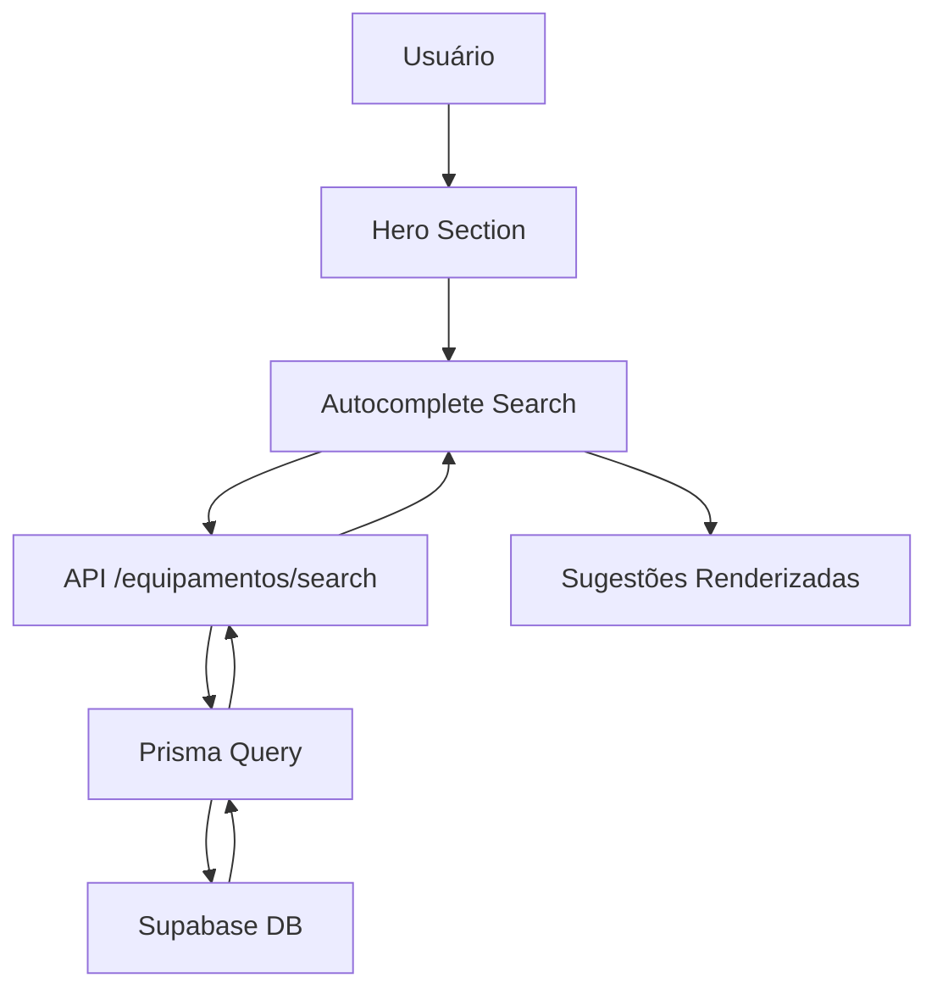

# 🤖 AGENTS.md - Instruções Principais para Agentes de IA

> **ARQUIVO CRÍTICO**: Este é o primeiro arquivo que toda IA deve ler ao
> interagir com o projeto GB-Locações

## 📚 **DOCUMENTAÇÃO COMO FONTE DE VERDADE ABSOLUTA**

### 🚨 **CHECKLIST OBRIGATÓRIO ANTES DE QUALQUER IMPLEMENTAÇÃO**

> **⚠️ CRÍTICO**: Esta checklist DEVE ser executada ANTES de qualquer alteração
> no código. Não pule etapas!

#### **📋 PASSOS OBRIGATÓRIOS (NÃO PULE NENHUM)**

**1. 🔍 CONSULTAR ERROS CONHECIDOS (OBRIGATÓRIO)**

- [ ] Li completamente `docs/issues/known-issues.md`
- [ ] Busquei por palavras-chave relacionadas à tarefa atual
- [ ] Verifiquei se o problema/erro já foi resolvido anteriormente
- [ ] Confirmei que não estou repetindo uma solução já implementada
- [ ] Li as seções "Armadilhas a Evitar" dos problemas similares

**2. 📖 CONSULTAR DOCUMENTAÇÃO DE COMPONENTES (OBRIGATÓRIO)**

- [ ] Verifiquei se existe documentação em `docs/features/[componente].md` ou
      `docs/features/[pagina].md`
- [ ] **LI COMPLETAMENTE** a documentação do componente/página antes de fazer
      QUALQUER atividade (alterar, debugar, corrigir, otimizar, refatorar, etc.)
- [ ] Entendi o propósito e lógica de funcionamento documentada
- [ ] Entendi o fluxo atual documentado
- [ ] Verifiquei seções de "Como Usar", "Armadilhas", "Lições Aprendidas"
- [ ] Confirmei padrões e convenções documentados
- [ ] Verifiquei se há exemplos de código que devo seguir
- [ ] Se não existe documentação, **PERGUNTE** ao usuário sobre o funcionamento
      antes de fazer qualquer atividade

**3. 🎯 VERIFICAR COMPONENTES EXISTENTES (OBRIGATÓRIO)**

- [ ] Busquei se existe componente similar em `components/ui/` ou `components/`
- [ ] Verifiquei se posso reutilizar código existente em vez de criar novo
- [ ] Confirmei padrões de nomenclatura e estrutura dos componentes existentes
- [ ] Li a documentação de componentes relacionados (ex: se for dialog, ler
      `dialog-lab.md`)

**4. 🔧 VERIFICAR IMPLEMENTAÇÕES PASSADAS (OBRIGATÓRIO)**

- [ ] Busquei no código por implementações similares usando `codebase_search`
- [ ] Verifiquei `CHANGELOG.md` para ver mudanças recentes relacionadas
- [ ] Confirmei que não estou reintroduzindo código que foi removido/corrigido
- [ ] Verifiquei padrões de código usados em implementações recentes

**5. ✅ VALIDAÇÃO FINAL (OBRIGATÓRIO)**

- [ ] Confirmei que entendi o problema/solicitação completamente
- [ ] Sei exatamente quais arquivos vou modificar
- [ ] Tenho certeza de que não estou repetindo erros documentados
- [ ] Estou seguindo padrões e convenções estabelecidos
- [ ] Vou documentar a mudança no CHANGELOG.md após implementar

**6. 🧠 CONSULTAR CONTEXTO CRÍTICO (OBRIGATÓRIO)**

- [ ] Li a seção "CONTEXTO CRÍTICO DO PROJETO" no AGENTS.md
- [ ] Verifiquei se há informações cruciais relacionadas à minha tarefa
- [ ] Identifiquei se minha implementação envolve informações cruciais
- [ ] Se sim, vou documentar automaticamente após implementar
- [ ] **SE VOU TRABALHAR COM PÁGINA/COMPONENTE**: Li completamente
      `docs/features/[nome].md` ANTES de fazer QUALQUER atividade (alterar,
      debugar, corrigir, otimizar, refatorar, adicionar feature, etc.)
- [ ] **SE NÃO EXISTE DOCUMENTAÇÃO**: Perguntei ao usuário sobre o funcionamento
      atual antes de fazer qualquer atividade
- [ ] Tenho contexto completo sobre como a página/componente funciona
- [ ] Após alterar, vou atualizar a documentação de lógica de funcionamento

### ✅ **CHECKLIST PÓS-IMPLEMENTAÇÃO (OBRIGATÓRIO)**

Após QUALQUER implementação, execute esta checklist:

**1. 📝 DOCUMENTAÇÃO ATUALIZADA**

- [ ] Atualizei `CHANGELOG.md` com a data real do commit
- [ ] Criei/atualizei documentação em `docs/features/` se aplicável
- [ ] Atualizei referências no AGENTS.md se necessário
- [ ] Documentei lógica de funcionamento se o usuário explicou o comportamento

**2. 🐛 PROBLEMAS CONHECIDOS**

- [ ] Se resolvi um bug, documentei em `docs/issues/known-issues.md`
- [ ] Incluí: causa raiz, solução, arquivos modificados, como validar
- [ ] Adicionei seção "Armadilhas a Evitar" se aplicável

**3. 🧪 VALIDAÇÃO**

- [ ] Testei a funcionalidade implementada
- [ ] Verifiquei que não quebrei funcionalidades existentes
- [ ] Confirmei que estilos/identidade visual não foram alterados sem
      solicitação

#### **🚨 SE VOCÊ NÃO SEGUIU A CHECKLIST COMPLETA:**

**PARE IMEDIATAMENTE e:**

1. Execute TODOS os passos acima
2. Leia os arquivos relevantes completamente
3. Só então prossiga com a implementação

#### **📚 ARQUIVOS DE REFERÊNCIA OBRIGATÓRIOS**

| Tipo de Tarefa                     | Arquivo(s) Obrigatório(s) a Ler                                  |
| ---------------------------------- | ---------------------------------------------------------------- |
| **Qualquer implementação**         | `docs/issues/known-issues.md` (TODO o arquivo)                   |
| **Bug report**                     | `docs/issues/known-issues.md` + componente relacionado           |
| **Modificar componente existente** | `docs/features/[componente].md` + código fonte                   |
| **Criar novo componente**          | `docs/features/design-system.md` + componentes similares         |
| **Dialog/Modal**                   | `docs/features/dialog-lab.md` + `app/playground/page.tsx`        |
| **Animação**                       | `docs/issues/known-issues.md` (seções de animação)               |
| **Responsividade**                 | `AGENTS.md` (seção Responsive Design) + `known-issues.md`        |
| **Admin pages**                    | `docs/features/admin-system.md`                                  |
| **Autocomplete/Search**            | `docs/features/autocomplete-search.md`                           |
| **Sistema de Orçamentos**          | `AGENTS.md` (seção "Sistema de Orçamentos")                      |
| **Dados cadastrais da empresa**    | `docs/internal/company/README.md` + PDF CNPJ                     |
| **Informação crucial**             | `AGENTS.md` (seção "CONTEXTO CRÍTICO DO PROJETO")                |
| **Lógica de página/componente**    | `docs/features/[nome].md` + `AGENTS.md` (seção Contexto Crítico) |

#### **❌ NUNCA FAÇA SEM CONSULTAR PRIMEIRO:**

- ❌ **NÃO** implemente soluções sem ler erros conhecidos relacionados
- ❌ **NÃO** modifique componentes sem ler sua documentação completa
- ❌ **NÃO** crie código novo sem verificar se já existe algo similar
- ❌ **NÃO** reintroduza código que foi removido por causar bugs
- ❌ **NÃO** ignore seções "Armadilhas a Evitar" nos documentos
- ❌ **NÃO** assuma que sabe como fazer sem consultar a documentação

#### **✅ SEMPRE FAÇA:**

- ✅ **SEMPRE** leia `docs/issues/known-issues.md` completamente antes de
  começar
- ✅ **SEMPRE** busque por palavras-chave relacionadas à sua tarefa
- ✅ **SEMPRE** leia a documentação do componente antes de modificá-lo
- ✅ **SEMPRE** verifique se há implementações similares no código
- ✅ **SEMPRE** siga padrões documentados, não invente novos
- ✅ **SEMPRE** consulte "Lições Aprendidas" dos problemas anteriores

---

### ⚠️ **PROTOCOLO ANTI-ALUCINAÇÃO OBRIGATÓRIO**

1. **🚨 NUNCA ALUCINE**: Se não souber algo, consulte `docs/` PRIMEIRO
2. **📖 LEIA ANTES DE AGIR**: Consulte a documentação antes de implementar
3. **🎯 SIGA OS PADRÕES**: Use apenas componentes e práticas documentadas
4. **📝 DOCUMENTE MUDANÇAS**: SEMPRE atualize o `CHANGELOG.md` após alterações
5. **📚 DOCUMENTE PROATIVAMENTE**: SEMPRE crie/atualize documentação em `docs/`
   nas respectivas pastas após implementar novas funcionalidades
6. **🗓️ NUNCA INVENTE DATAS**: SEMPRE use datas reais dos commits Git para o
   CHANGELOG
   - Use `git log --pretty=format:"%h %ad %s" --date=short` para verificar datas
     reais
   - NUNCA invente datas como "2024-12-20" ou "2025-01-15" sem verificar commits
   - SEMPRE consulte o histórico Git antes de adicionar entradas ao CHANGELOG
7. **🐛 CONSULTE PROBLEMAS CONHECIDOS**: Antes de investigar um bug, verifique
   `docs/issues/known-issues.md`
   - Evita re-investigar problemas já resolvidos
   - Economiza tempo e mantém soluções consistentes
   - Documente novos bugs resolvidos neste arquivo
8. **🔍 EXECUTE A CHECKLIST OBRIGATÓRIA**: Antes de QUALQUER implementação,
   execute completamente a checklist acima
   - Garante que você não está repetindo erros corrigidos
   - Assegura que está seguindo padrões documentados
   - Previne reintrodução de bugs conhecidos
9. **🧠 DOCUMENTE CONTEXTO CRÍTICO**: Sempre que implementar algo que se
   enquadre nos critérios de informação crucial:
   - Identifique automaticamente se é crucial
   - Documente imediatamente na seção "CONTEXTO CRÍTICO DO PROJETO"
   - Use o formato padronizado estabelecido
   - Garanta que futuras IAs tenham esse contexto
   - Se tiver dúvida se é crucial → PERGUNTE ao usuário antes de documentar
10. **📄 DOCUMENTE LÓGICA DE FUNCIONAMENTO**: Sempre que o usuário explicar
    "como eu quero que a página/componente funcione" ou descrever o
    comportamento esperado:
    - **INTERPRETE ISSO COMO SINAL** de que você DEVE documentar a lógica de
      funcionamento
    - Documente imediatamente na seção "CONTEXTO CRÍTICO DO PROJETO" ou em
      `docs/features/[componente].md`
    - Inclua: propósito, fluxo de funcionamento, regras de negócio aplicadas,
      estados e comportamentos esperados
    - Garanta que futuras IAs tenham contexto completo sobre como a
      página/componente funciona
    - **NUNCA** implemente sem documentar a lógica quando o usuário explicar o
      funcionamento desejado
11. **🔄 CONSULTE E ATUALIZE LÓGICA SEMPRE**: Sempre que for trabalhar com uma
    página/componente (alterar, debugar, corrigir, otimizar, refatorar, etc.):
    - **SEMPRE** consulte primeiro
      `docs/features/[nome-pagina-ou-componente].md`
    - **SEMPRE** verifique se existe arquivo na pasta `docs/features/`
    - **SEMPRE** **LEIA COMPLETAMENTE** a documentação ANTES de fazer QUALQUER
      atividade
    - **SEMPRE** entenda o propósito e lógica de funcionamento documentada
    - **SEMPRE** entenda o fluxo atual documentado antes de fazer qualquer
      mudança
    - **SEMPRE** tenha contexto completo sobre como funciona antes de começar
    - **SEMPRE** atualize o arquivo em `docs/features/` após fazer alterações
    - **SEMPRE** atualize a referência no AGENTS.md se necessário
    - **SEMPRE** reflita mudanças no comportamento esperado na documentação
    - **SEMPRE** atualize estados, fluxos e regras se mudaram
    - Se não houver documentação, **PERGUNTE** ao usuário sobre o funcionamento
      atual antes de fazer qualquer atividade e **CRIE** arquivo em
      `docs/features/` após entender
12. **📁 DOCUMENTAÇÃO EM `docs/features/`**: Sempre que documentar lógica de
    funcionamento de páginas/componentes:
    - **SEMPRE** crie/atualize arquivo em
      `docs/features/[nome-pagina-ou-componente].md`
    - **SEMPRE** use kebab-case para nomes de arquivos (ex: `orcamento-page.md`,
      `equipment-card.md`)
    - **SEMPRE** adicione referência na seção "CONTEXTO CRÍTICO DO PROJETO" do
      AGENTS.md apontando para o arquivo
    - **SEMPRE** siga o formato padronizado estabelecido
    - **NUNCA** documente apenas no AGENTS.md sem criar arquivo em
      `docs/features/`
    - **NUNCA** deixe documentação desatualizada após alterações

### 🟠 Dialogs aninhadas (Base UI)

> **⚠️ CRÍTICO**: Para implementar dialogs aninhadas com efeito visual (dialog
> filha acima, dialog pai menor e mais abaixo), siga **EXATAMENTE** o padrão
> documentado abaixo. Consulte `components/dialogs/category-dialog.tsx` (linhas
> 1539-1636) como referência de implementação correta.

#### **📋 PADRÃO OBRIGATÓRIO DE IMPLEMENTAÇÃO**

**1. Estado para controlar a dialog aninhada:**

```typescript
const [nestedDialogOpen, setNestedDialogOpen] = useState(false)
```

**2. Dialog Pai - Configurar `data-nested-parent`:**

A dialog pai **DEVE** receber o atributo `data-nested-parent` quando a dialog
filha estiver aberta:

```tsx
<Dialog.Popup
  variant="default"
  data-nested-parent={nestedDialogOpen ? "" : undefined}
>
  <Dialog.Content>
    {/* ... conteúdo da dialog pai ... */}
    <Dialog.Body>
      <Dialog.BodyViewport>
        <Dialog.BodyContent>
          {/* Conteúdo da dialog pai */}

          {/* 3. Dialog Aninhada - Renderizar DENTRO do Dialog.BodyContent */}
          {condition && (
            <Dialog.Root
              open={nestedDialogOpen}
              onOpenChange={setNestedDialogOpen}
            >
              <Dialog.Portal>
                <Dialog.Backdrop />
                <Dialog.Popup variant="default">
                  <Dialog.Content>
                    {/* Conteúdo da dialog filha */}
                  </Dialog.Content>
                </Dialog.Popup>
              </Dialog.Portal>
            </Dialog.Root>
          )}
        </Dialog.BodyContent>
      </Dialog.BodyViewport>
    </Dialog.Body>
  </Dialog.Content>
</Dialog.Popup>
```

#### **🚨 REGRAS CRÍTICAS**

1. **Dialog aninhada DEVE estar dentro do `Dialog.BodyContent` da dialog pai**:
   - ❌ **NUNCA** renderize a dialog aninhada fora da dialog pai
   - ❌ **NUNCA** renderize como componente separado no mesmo nível
   - ✅ **SEMPRE** renderize dentro do `Dialog.BodyContent` da dialog pai

2. **Dialog pai DEVE ter `data-nested-parent`**:

   ```tsx
   data-nested-parent={nestedDialogOpen ? '' : undefined}
   ```

   - Quando `nestedDialogOpen` é `true`, passa string vazia `''`
   - Quando `false`, passa `undefined` para remover o atributo

3. **Dialog filha DEVE usar `variant="default"`**:
   - O `variant="default"` já inclui todas as classes CSS necessárias para o
     efeito nested
   - Não precisa adicionar `data-nested` manualmente - o Base UI gerencia
     automaticamente

#### **🎨 EFEITO VISUAL AUTOMÁTICO**

O Base UI detecta automaticamente dialogs aninhadas e aplica o efeito através da
variável CSS `--nested-dialogs`:

**Dialog Filha (aninhada):**

- Fica mais acima: `top-[calc(50%+1rem*var(--nested-dialogs))]`
- Tamanho reduzido: `scale-[calc(1-0.1*var(--nested-dialogs))]`

**Dialog Pai:**

- Move para baixo: `translate-y-[0.85rem]` (quando tem `data-nested-parent`)
- Tamanho reduzido: `scale-[0.985]` (quando tem `data-nested-parent`)

**Resultado Visual:**

- Dialog filha aparece acima e em destaque
- Dialog pai recua levemente para baixo e fica menor
- Efeito similar ao Sonner (toasts empilhados)

#### **📚 EXEMPLO COMPLETO DE REFERÊNCIA**

Consulte `components/dialogs/category-dialog.tsx`:

- **Dialog Pai**: Linhas 1539-1545 (configuração `data-nested-parent`)
- **Dialog Aninhada**: Linhas 1616-1636 (renderizada dentro do
  `Dialog.BodyContent`)

Consulte `components/dialogs/view-equipment-dialog.tsx`:

- **Dialog Pai**: Linha 178 (configuração `data-nested-parent`)
- **Dialog Aninhada**: Linhas 539-589 (renderizada dentro do
  `Dialog.BodyContent`)

#### **⚠️ ANTI-PADRÕES - NUNCA FAÇA**

- ❌ **NUNCA** renderize a dialog aninhada fora da dialog pai
- ❌ **NUNCA** renderize como componente separado no mesmo nível do JSX
- ❌ **NUNCA** adicione `data-nested` manualmente na dialog filha
- ❌ **NUNCA** remova o `variant="default"` da dialog filha
- ❌ **NUNCA** esqueça de configurar `data-nested-parent` na dialog pai

#### **✅ CHECKLIST DE IMPLEMENTAÇÃO**

Antes de considerar uma dialog aninhada implementada corretamente:

- [ ] Estado criado para controlar a dialog aninhada
- [ ] Dialog pai tem `data-nested-parent={nestedDialogOpen ? '' : undefined}`
- [ ] Dialog aninhada renderizada **DENTRO** do `Dialog.BodyContent` da dialog
      pai
- [ ] Dialog aninhada usa `variant="default"`
- [ ] Dialog aninhada tem seu próprio `Dialog.Portal` e `Dialog.Backdrop`
- [ ] Efeito visual funciona: dialog filha acima, dialog pai abaixo e menor
- [ ] Testado em diferentes resoluções

#### **🔧 DETALHES TÉCNICOS**

- **Base UI gerencia automaticamente**: O Base UI detecta quando há uma dialog
  aninhada dentro do conteúdo da dialog pai e aplica `--nested-dialogs`
  automaticamente
- **Classes CSS**: As classes necessárias já estão em `components/ui/dialog.tsx`
  no `POPUP_CLASS_VARIANTS.default`
- **Dimensões**: Ajuste `max-w`, `max-h`, `w`, `h` conforme necessário, mas
  mantenha `variant="default"` para preservar o efeito nested
- **Backdrop**: Cada dialog aninhada deve ter seu próprio `Dialog.Backdrop`
- **Portal**: Cada dialog aninhada deve ter seu próprio `Dialog.Portal`

#### **📖 DOCUMENTAÇÃO ADICIONAL**

- `docs/features/dialog-lab.md` - Documentação completa do sistema de dialogs
- `app/playground/page.tsx` - Exemplos interativos de dialogs
- `components/dialogs/category-dialog.tsx` - Implementação de referência
  completa

### 🔢 Stack global de camadas (z-index)

- `app/globals.css` define tokens `--layer-*` para TODA sobreposição (floating,
  sticky, dropdown, popover, dialog, tooltip e spotlight). **Nunca** invente
  novos valores numéricos; use os tokens.
- Dialogs Base UI devem usar `z-[var(--layer-dialog-backdrop)]` no backdrop e
  `z-[var(--layer-dialog)]` no popup. Tooltips/Popovers usam
  `z-[var(--layer-tooltip)]` ou `z-[var(--layer-popover)]`.
- Dropdowns/autocomplete mantêm `relative z-[var(--layer-dropdown)]` no campo e
  `z-[var(--layer-popover)]` para o menu/flutuante (inclusive portais).
- Os aliases legados `--z-dropdown`, `--z-popover`, `--z-modal` e `--z-tooltip`
  continuam válidos e apontam para os mesmos tokens.

### **📝 PROTOCOLO DE DOCUMENTAÇÃO PROATIVA (OBRIGATÓRIO)**

#### **🎯 REGRA FUNDAMENTAL**

**TODA nova funcionalidade, componente ou mudança significativa DEVE ser
documentada proativamente em `docs/` na pasta apropriada.**

#### **📁 Onde Documentar**

- **Novo Componente**: `docs/features/[nome-componente].md`
- **Nova Funcionalidade**: `docs/features/[nome-feature].md`
- **Guias e Tutoriais**: `docs/guides/[nome-guia].md`
- **Decisões Técnicas**: `docs/internal/[nome-decisao].md`
- **APIs e Integrações**: `docs/architecture/api.md` ou criar novo arquivo

#### **❌ NUNCA FAÇA**

- ❌ **NUNCA** crie arquivos `.md` na **raiz do projeto**
- ❌ **NUNCA** deixe funcionalidade sem documentação
- ❌ **NUNCA** documente apenas no código (JSDoc não substitui docs/)

#### **✅ SEMPRE FAÇA**

- ✅ **SEMPRE** documente em `docs/` nas pastas apropriadas
- ✅ **SEMPRE** leia documentação existente antes de criar nova
- ✅ **SEMPRE** atualize `CHANGELOG.md` + arquivo específico em `docs/`
- ✅ **SEMPRE** siga o formato e estrutura existente em `docs/`

### **📁 ESTRUTURA DA DOCUMENTAÇÃO (ATUALIZADA - JAN 2025)**

```
📁 docs/                          # CONSULTAR SEMPRE PRIMEIRO
├── 📄 README.md                  # Índice geral da documentação
├── 📁 getting-started/           # Setup, desenvolvimento, deploy
│   ├── 📄 installation.md       # Setup inicial + compatibilidade CRÍTICA
│   ├── 📄 development.md        # Padrões de desenvolvimento OBRIGATÓRIOS
│   ├── 📄 deployment.md         # Deploy e produção
│   └── 📄 troubleshooting.md    # Soluções de problemas + compatibilidade
├── 📁 architecture/              # Arquitetura técnica
│   ├── 📄 overview.md           # Stack + arquitetura COMPLETA
│   ├── 📄 api.md                # Documentação das APIs
│   └── 📄 security.md           # Aspectos de segurança
├── 📁 features/                  # Funcionalidades específicas
│   ├── 📄 admin-system.md       # Sistema admin COMPLETO
│   ├── 📄 design-system.md      # Identidade visual + componentes
│   └── 📄 autocomplete-search.md # 🆕 Sistema de busca autocomplete
├── 📁 guides/                    # Guias específicos
│   ├── 📄 storybook.md          # Documentação Storybook
│   ├── 📄 accessibility.md      # Melhorias de acessibilidade
│   └── 📄 scroll-reveal.md      # Sistema scroll reveal
├── 📁 references/                # Referências técnicas
│   └── 📄 dependencies.md       # Compatibilidade dependências CRÍTICA
├── 📁 issues/                    # Issues e problemas
│   └── 📄 known-issues.md       # 🆕 Problemas conhecidos e soluções
└── 📁 internal/                  # Documentação interna
    ├── 📄 cursor-setup.md       # Setup específico Cursor
    ├── 📄 project-decisions.md  # Decisões arquiteturais
    ├── 📄 tools.md              # Ferramentas internas
    └── 📁 company/              # 📄 Documentos oficiais da empresa
        ├── 📄 README.md         # Documentação dos documentos
        └── 📄 cnpj-gustavo-barbosa-brenner.pdf  # Comprovante CNPJ
```

### **📋 TEMPLATES OBRIGATÓRIOS PARA DOCUMENTAÇÃO**

Ao criar documentação para novos componentes ou páginas em `docs/features/`,
**SEMPRE** siga este template padrão:

```markdown
# [Nome do Componente/Página] - Documentação

## 1. Propósito

(Descreva o que este componente/página faz e por que existe no projeto.)

## 2. Lógica de Funcionamento

(Detalhe o fluxo de dados, estados, interações e regras de negócio.)

## 3. Arquitetura e Dependências

- Arquivos relacionados
- Componentes que utiliza
- APIs que consome

## 4. Como Usar

(Exemplos de código, props disponíveis e casos de uso.)

## 5. Armadilhas a Evitar

(Liste problemas comuns, usos incorretos e o que NÃO fazer.)

## 6. Lições Aprendidas

(Documente erros passados e suas soluções relacionadas a este componente.)

## 7. Histórico de Alterações

| Data       | Descrição            | Autor |
| ---------- | -------------------- | ----- |
| YYYY-MM-DD | Descrição da mudança | Nome  |
```

**⚠️ REGRA**: Toda nova documentação em `docs/features/` DEVE seguir este
template.

---

## 🎯 **CONTEXTO DO PROJETO GB-LOCAÇÕES**

**GB-Locações** é uma plataforma moderna de locação de equipamentos para
construção civil, desenvolvida com Next.js 16, TypeScript, Prisma, PostgreSQL e
design system robusto.

### **🏢 Dados Cadastrais Oficiais da Empresa**

> **⚠️ IMPORTANTE**: Quando precisar de dados cadastrais oficiais da empresa
> (CNPJ, endereço, telefone, email, atividades econômicas, etc.), consulte
> `docs/internal/company/README.md` e o documento PDF correspondente.

**Localização dos Documentos**: `docs/internal/company/`

**Informações Principais Disponíveis**:

- ✅ CNPJ: 34.780.330/0001-69
- ✅ Nome Empresarial: GUSTAVO BARBOSA BRENNER
- ✅ Nome Fantasia: GB LOCACOES E MANUTENCAO
- ✅ Endereço completo (logradouro, número, CEP, bairro, município)
- ✅ Contatos (email, telefone)
- ✅ Atividades econômicas (principal e secundárias)
- ✅ Natureza jurídica
- ✅ Situação cadastral

**Quando Consultar**:

- Preencher formulários com dados oficiais
- Gerar documentos legais ou contratos
- Configurar integrações que precisem de dados cadastrais
- Validar informações em sistemas externos
- Atualizar dados em registros ou configurações

### **🏛️ Stack Tecnológico Principal**

- **Framework**: Next.js 16.0.3 (App Router)
- **Linguagem**: TypeScript 5.9.2
- **UI**: React 19.1.1 + Tailwind CSS 3.4.17
- **Database**: PostgreSQL + Prisma
- **Auth**: NextAuth.js 4.24.11
- **State**: Zustand 5.0.7 + React Hook Form 7.62.0
- **Testing**: Vitest + Testing Library + Playwright
- **Design System**: Storybook 9.1.1 + Radix UI
- **Pagamentos / Boleto (Asaas)**: Gateway ativo no sandbox; webhook em
  `https://locacoesgb.com.br/api/payments/asaas/webhook` com token/assinatura;
  env obrigatórios (`ASAAS_API_KEY`, `ASAAS_WEBHOOK_SECRET`, `ASAAS_BASE_URL`,
  `BOLETO_GATEWAY_TYPE=asaas`). Nunca commitar `.env.local`.

### **⚠️ COMPATIBILIDADES CRÍTICAS & PROBLEMAS CONHECIDOS**

> **OBRIGATÓRIO**: Consulte `docs/references/dependencies.md` antes de atualizar
> dependências
>
> **🐛 CONSULTAR SEMPRE**: `docs/issues/known-issues.md` antes de investigar
> bugs

#### **🚨 PROBLEMAS CRÍTICOS RESOLVIDOS (DEZ 2024 - JAN 2025)**

- **Prisma**: Versão estável e funcional
- **Prisma 6.15.0**: Descoberta crítica - variável
  `PRISMA_GENERATE_DATAPROXY="false"` força `engine=none` causando erro P6001
- **Tailwind**: Manter em 3.4.17 (usuário prefere versão atual)
- **PNPM**: Recomendado NPM (PNPM causa conflitos com Prisma)
- **Build failing**: Script `scripts/post-prisma-generate.js` criado para
  resolver conflito do Prisma deletar `lib/validations/index.ts`
- **TypeScript errors**: 42 erros resolvidos com tipos específicos e safe
  navigation
- **ESLint overwhelming**: 31,469 problemas resolvidos com ignore patterns e
  automation
- **swagger-ui-react**: Removido por incompatibilidade React 19, substituído por
  implementação custom
- **node-domexception deprecated**: Override com `npm:@types/node@*`
  implementado
- **Dessincronização de Animações Hero (NOV 2025)**: Flash de imagem aparecia
  antes do conteúdo após reset de cache. Resolvido com evento customizado
  `scrollRevealReady` para sincronizar Framer Motion com scroll-reveal-init.
  Detalhes completos em `docs/issues/known-issues.md`

---

## 🧠 **FLUXO DE TRABALHO OBRIGATÓRIO**

### **📖 Antes de Implementar QUALQUER Funcionalidade:**

```
0. ✅ EXECUTAR CHECKLIST OBRIGATÓRIA (ACIMA - NÃO PULE!)
   ↓
   ├─ 🔍 Consultar docs/issues/known-issues.md (OBRIGATÓRIO)
   ├─ 📖 Ler documentação do componente em docs/features/
   ├─ 🎯 Verificar componentes existentes em components/
   └─ 🔧 Verificar implementações passadas no código
   ↓
1. 📚 LER docs/architecture/overview.md (arquitetura)
   ↓
2. 📚 LER docs/features/design-system.md (componentes)
   ↓
3. 📚 LER docs/getting-started/development.md (padrões)
   ↓
4. 🔍 VERIFICAR docs/references/dependencies.md (compatibilidade)
   ↓
5. 🎨 USAR apenas componentes documentados
   ↓
6. 🏗️ IMPLEMENTAR seguindo padrões estabelecidos
   ↓
7. 📝 ATUALIZAR CHANGELOG.md com as mudanças
   ↓
8. ✅ TESTAR com referência na documentação
```

> **⚠️ CRÍTICO**: O passo 0 (Checklist Obrigatória) é OBRIGATÓRIO e não pode ser
> pulado. Ele garante que você não está repetindo erros já corrigidos e está
> seguindo padrões documentados.

### **🎨 Design System - REGRAS OBRIGATÓRIAS**

1. **Use APENAS** componentes de `components/ui/` (baseados em Radix UI)
2. **Consulte** `stories/` para ver componentes visuais no Storybook
3. **Cores**: Orange-600 (#ea580c) como cor primária da marca
4. **Tipografia**: Inter (sans) + Jost (headings)
5. **Não invente** novos componentes sem consultar design system

### **📱 Responsive Design - DOUTRINA OBRIGATÓRIA**

#### **🚨 REGRA FUNDAMENTAL**

**TODA nova implementação DEVE seguir RIGOROSAMENTE os padrões de responsividade
e espaçamento já estabelecidos no projeto.**

#### **📏 SISTEMA DE ESPAÇAMENTO OBRIGATÓRIO**

**Containers Principais:**

- **Mobile**: `px-4` (16px lateral)
- **Tablet**: `sm:px-6` (24px lateral)
- **Desktop**: `lg:px-8` (32px lateral)
- **Padrão Completo**: `px-4 sm:px-6 lg:px-8`

**Espaçamento Vertical Entre Seções:**

- **Mobile**: `py-8` ou `py-12` (32px-48px)
- **Tablet**: `md:py-12` ou `md:py-16` (48px-64px)
- **Desktop**: `lg:py-16` ou `lg:py-20` (64px-80px)
- **Padrão Completo**: `py-12 md:py-16 lg:py-20`

**Gaps em Grids:**

- **Mobile**: `gap-4` ou `gap-6` (16px-24px)
- **Tablet**: `md:gap-6` ou `md:gap-8` (24px-32px)
- **Desktop**: `lg:gap-8` ou `lg:gap-12` (32px-48px)
- **Padrão Completo**: `gap-6 md:gap-8 lg:gap-12`

#### **🏗️ PADRÕES DE GRID RESPONSIVO OBRIGATÓRIOS**

**Grid de Cards/Produtos:**

```typescript
// PADRÃO OBRIGATÓRIO para listagem de itens
className =
  "grid grid-cols-1 md:grid-cols-2 lg:grid-cols-3 xl:grid-cols-4 gap-6 md:gap-8"

// Para cards maiores (destaque)
className = "grid grid-cols-1 md:grid-cols-2 gap-8 md:gap-12"

// Para estatísticas/métricas
className = "grid grid-cols-2 md:grid-cols-4 gap-4 md:gap-6"
```

**Layout de Conteúdo:**

```typescript
// Sidebar + Conteúdo
className = "grid grid-cols-1 lg:grid-cols-4 gap-8 lg:gap-12"

// Duas colunas equilibradas
className = "grid grid-cols-1 md:grid-cols-2 gap-8 md:gap-12"

// Três colunas (features, benefícios)
className = "grid grid-cols-1 md:grid-cols-3 gap-6 md:gap-8"
```

#### **📝 TIPOGRAFIA RESPONSIVA OBRIGATÓRIA**

**Hierarquia de Títulos:**

```typescript
// H1 - Títulos principais
className = "text-3xl md:text-4xl lg:text-5xl xl:text-6xl font-bold"

// H2 - Títulos de seção
className = "text-2xl md:text-3xl lg:text-4xl font-bold"

// H3 - Subtítulos
className = "text-xl md:text-2xl lg:text-3xl font-semibold"

// H4 - Títulos menores
className = "text-lg md:text-xl lg:text-2xl font-semibold"
```

**Texto Corpo:**

```typescript
// Texto principal
className = "text-base md:text-lg leading-relaxed"

// Texto secundário
className = "text-sm md:text-base text-gray-600"

// Texto pequeno (legendas, etc.)
className = "text-xs md:text-sm text-gray-500"
```

#### **❌ ANTI-PADRÕES - NUNCA FAÇA**

**Espaçamento Proibido:**

- ❌ NUNCA use valores fixos sem responsividade: `p-8` (sem `md:p-12`)
- ❌ NUNCA ignore breakpoints: `px-4` sem `sm:px-6 lg:px-8`
- ❌ NUNCA use espaçamentos inconsistentes com o projeto

**Grid Proibido:**

- ❌ NUNCA use grids sem responsividade: `grid-cols-3` (sem `md:grid-cols-3`)
- ❌ NUNCA ignore o padrão mobile-first
- ❌ NUNCA use layouts que quebrem em mobile

**Tipografia Proibida:**

- ❌ NUNCA use tamanhos fixos sem responsividade
- ❌ NUNCA ignore a hierarquia estabelecida
- ❌ NUNCA use fontes que não sejam do design system

#### **Breakpoints Padrão**

- **Mobile**: < 640px
- **Small**: 640px+ (`sm:`)
- **Medium**: 768px+ (`md:`)
- **Large**: 1024px+ (`lg:`)
- **Extra Large**: 1280px+ (`xl:`)
- **2XL**: 1536px+ (`2xl:`)

#### **Mobile-First Obrigatório**

- Comece sempre com estilos mobile
- Use `sm:`, `md:`, `lg:`, `xl:`, `2xl:` para breakpoints maiores
- Teste em dispositivos reais sempre
- Mantenha consistência com padrões estabelecidos

---

## 🏗️ **PADRÕES DE ARQUITETURA**

### **📁 Estrutura de Diretórios**

```
GB-Locacoes/
├── app/                    # App Router (Next.js 16)
│   ├── admin/             # Área administrativa
│   ├── api/               # API Routes
│   └── (public)/          # Rotas públicas
├── components/            # Componentes React
│   ├── ui/               # Componentes base (Radix UI) ← USAR SEMPRE
│   └── (feature)/        # Componentes específicos
├── lib/                  # Utilitários e configurações
├── hooks/                # Custom hooks
├── types/                # Definições TypeScript
├── schemas/              # Schemas de validação (Zod)
├── prisma/               # Schema e migrações
├── stories/              # Storybook stories ← CONSULTAR SEMPRE
├── design-tokens/        # Sistema de design tokens
└── tests/                # Testes
```

### **📊 DIAGRAMAS DE ARQUITETURA (RECOMENDADO)**

Para facilitar a compreensão do sistema, utilize diagramas Mermaid quando
documentar:

- Fluxos de dados complexos
- Relações entre componentes
- Processos de negócio

**Exemplo de uso em documentação:**



**Onde usar:**

- `docs/architecture/` - Diagramas de alto nível
- `docs/features/[componente].md` - Diagramas específicos do componente

### **⚙️ Padrões de Desenvolvimento**

#### **TypeScript (Obrigatório)**

- **Strict Mode**: Sempre habilitado
- **Não use**: `any` (preferir tipos específicos)
- **Interfaces**: Para objetos, `types` para unions
- **Validação**: Sempre use Zod para schemas

#### **React Patterns**

- **Hooks**: Custom hooks para lógica reutilizável
- **ForwardRef**: Para componentes que precisam de ref
- **Formulários**: SEMPRE React Hook Form + Zod

#### **Nomenclatura**

- **Componentes**: PascalCase (`EquipmentCard.tsx`)
- **Hooks**: camelCase com `use` (`useQuoteForm.ts`)
- **Utilitários**: camelCase (`formatCurrency.ts`)
- **Constantes**: UPPER_SNAKE_CASE (`API_ENDPOINTS`)

---

## 🎨 **SISTEMA DE DESIGN - GUIA RÁPIDO**

### **🎨 Paleta de Cores**

```css
/* Cores Primárias */
--orange-600: #ea580c; /* Cor principal da marca */
--orange-500: #f97316; /* Hover states */
--orange-700: #c2410c; /* Active states */

/* Cores Neutras */
--slate-50: #f8fafc; /* Background claro */
--slate-800: #1e293b; /* Texto principal */
--slate-600: #475569; /* Texto secundário */
```

### **📝 Componentes Base (USAR SEMPRE)**

```tsx
// Componentes principais em components/ui/
import { Button } from "@/components/ui/button"
import { Card, CardContent, CardHeader, CardTitle } from "@/components/ui/card"
import { Input } from "@/components/ui/input"
import { Label } from "@/components/ui/label"
import { Select } from "@/components/ui/select"
// ... outros componentes documentados
```

### **🎭 Animações (Framer Motion)**

```tsx
// Padrão de entrada
<motion.div
  initial={{ opacity: 0, y: 20 }}
  animate={{ opacity: 1, y: 0 }}
  transition={{ duration: 0.3 }}
>
```

---

## 🔐 **SISTEMA ADMINISTRATIVO**

### **🚀 Template Base para Páginas Admin**

> Consulte `docs/features/admin-system.md` para template completo

```tsx
"use client"

import { AdminPageHeader } from "@/components/admin/admin-page-header"
import { AdminCard } from "@/components/admin/admin-card"
import { motion } from "framer-motion"

export default function NovaPaginaAdmin() {
  return (
    <div className="min-h-screen bg-gradient-to-br from-slate-50 to-blue-50">
      <div className="max-w-7xl mx-auto space-y-6 p-6">
        <AdminPageHeader
          title="Título da Página"
          subtitle="Subtítulo explicativo"
          icon={<Package className="w-8 h-8" />}
        />

        <AdminCard title="Conteúdo">{/* Seu conteúdo aqui */}</AdminCard>
      </div>
    </div>
  )
}
```

### **🎨 Header Obrigatório Admin**

```tsx
// SEMPRE use este padrão para páginas admin
<div className="relative overflow-hidden bg-gradient-to-br from-orange-500 via-orange-600 to-orange-700 rounded-2xl p-6 text-white shadow-xl">
  {/* Gradientes de fundo */}
  <div className="absolute inset-0 bg-gradient-to-br from-orange-400/12 via-transparent to-black/15"></div>
  <div className="absolute inset-0 bg-gradient-to-tr from-transparent via-orange-500/6 to-orange-700/8"></div>

  <div className="relative z-10">{/* Conteúdo do header */}</div>
</div>
```

---

## 🧪 **TESTES - ESTRATÉGIA OBRIGATÓRIA**

### **🎯 Tipos de Teste**

- **Unit Tests**: Vitest + Testing Library
- **Integration Tests**: API Routes
- **E2E Tests**: Playwright
- **Visual Tests**: Storybook
- **Accessibility Tests**: axe-core

### **🚀 Comandos Principais**

```bash
# Desenvolvimento
pnpm dev                    # Servidor desenvolvimento
pnpm build                  # Build produção
pnpm type-check             # Verificar tipos

# Database
pnpm db:generate           # Gerar cliente Prisma
pnpm db:push               # Push schema
pnpm db:studio             # Prisma Studio

# Testes
pnpm test                  # Testes unitários
pnpm test:e2e              # Testes E2E
pnpm storybook             # Storybook

# Quality
pnpm lint                  # ESLint
pnpm lint:fix              # Auto-fix
pnpm format                # Prettier
```

---

## 📝 **PROTOCOLO DE CHANGELOG OBRIGATÓRIO**

### **🚨 REGRA CRÍTICA**: Toda alteração DEVE ser documentada no `CHANGELOG.md`

### **🗓️ PROTOCOLO DE DATAS - OBRIGATÓRIO**

**⚠️ ERRO CRÍTICO COMETIDO**: Em 22/09/2025, foram inventadas datas falsas no
CHANGELOG, causando perda de histórico real.

**✅ PROTOCOLO CORRETO PARA DATAS:**

1. **SEMPRE verifique datas reais**:

   ```bash
   git log --pretty=format:"%h %ad %s" --date=short -10
   ```

2. **NUNCA invente datas** como:
   - ❌ "2024-12-20" (projeto não existia)
   - ❌ "2025-01-15" (datas inventadas)
   - ❌ Qualquer data sem verificação Git

3. **Use APENAS datas dos commits reais**:
   - ✅ Verificar `git log` antes de adicionar entrada
   - ✅ Usar data do commit atual para mudanças novas
   - ✅ Manter histórico real intacto

4. **Comando para verificar datas atuais**:
   ```bash
   git log --oneline -5  # Últimos 5 commits com datas
   ```

#### **Formato Obrigatório:**

```markdown
## [Data] - Tipo de Mudança

### Added ✨

- Nova funcionalidade implementada
- Novo componente criado

### Changed 🔄

- Funcionalidade existente modificada
- Atualização de dependência

### Fixed 🐛

- Bug corrigido
- Problema de compatibilidade resolvido

### Removed ❌

- Funcionalidade removida
- Código legado eliminado

### Security 🔐

- Vulnerabilidade corrigida
- Melhoria de segurança
```

#### **Exemplos Práticos:**

```markdown
## [2024-12-20] - Atualização Sistema Admin

### Added ✨

- Componente AdminPageHeader para padronização
- Template base para páginas administrativas
- Documentação completa em docs/features/admin-system.md

### Changed 🔄

- Reorganizada estrutura de documentação em docs/
- Atualizado README.md com nova navegação
- Melhorado protocolo anti-alucinação para IAs

### Fixed 🐛

- Corrigido problema de compatibilidade Prisma 6.14.0
- Removidas duplicatas na documentação

### Security 🔐

- Implementado middleware de autenticação admin
- Validação aprimorada com Zod schemas
```

---

## 🔧 **BROWSERTOOLS INTEGRATION - PROTOCOLO DE USO**

> **⚠️ CRÍTICO**: Ferramenta MCP instalada e configurada. Use para maximizar
> produtividade.

### **🚀 COMANDOS DISPONÍVEIS**

#### **📸 Visual & Screenshots**

- `mcp_browser-tools_takeScreenshot` - Captura de tela automática
- `mcp_browser-tools_getSelectedElement` - Análise de elemento selecionado

#### **🔍 Auditorias & Análises**

- `mcp_browser-tools_runSEOAudit` - Auditoria SEO completa
- `mcp_browser-tools_runPerformanceAudit` - Análise de performance
- `mcp_browser-tools_runAccessibilityAudit` - Auditoria de acessibilidade
- `mcp_browser-tools_runBestPracticesAudit` - Boas práticas web

#### **🐛 Debug & Monitoring**

- `mcp_browser-tools_getConsoleLogs` - Logs do console
- `mcp_browser-tools_getConsoleErrors` - Erros JavaScript
- `mcp_browser-tools_getNetworkLogs` - Requisições de rede
- `mcp_browser-tools_getNetworkErrors` - Erros de rede
- `mcp_browser-tools_runDebuggerMode` - Modo debug avançado

#### **📊 Modos Avançados**

- `mcp_browser-tools_runAuditMode` - Análise completa da aplicação
- `mcp_browser-tools_runNextJSAudit` - Auditoria específica Next.js

### **⚡ WORKFLOW INTELIGENTE**

#### **Durante Desenvolvimento:**

```bash
# 0. INICIAR DESENVOLVIMENTO COM BROWSERTOOLS (RECOMENDADO)
pnpm dev:browsertools

# 1. Implementar funcionalidade
# 2. Capturar screenshot para documentar
"Tire uma screenshot da nova funcionalidade"

# 3. Verificar erros de console
"Verifique se há erros no console"

# 4. Testar responsividade
"Redimensione para mobile e tire screenshot"

# 5. Executar auditoria de performance
"Execute auditoria de performance"
```

#### **Antes do Deploy:**

```bash
# 1. Auditoria completa
"Execute modo de auditoria completo"

# 2. Verificar SEO
"Execute auditoria de SEO"

# 3. Verificar acessibilidade
"Execute auditoria de acessibilidade"

# 4. Verificar boas práticas
"Execute auditoria de boas práticas"
```

#### **Durante Debug:**

```bash
# 1. Analisar elemento problemático
"Analise o elemento selecionado no DevTools"

# 2. Verificar erros
"Verifique logs de console e rede"

# 3. Modo debug avançado
"Entre no modo debugger para análise profunda"
```

### **📋 CHECKLIST OBRIGATÓRIO BROWSERTOOLS**

Antes de qualquer commit:

- [ ] **🚀 SERVIDOR INICIADO**: `pnpm dev:browsertools` (recomendado) ou
      `npx @agentdeskai/browser-tools-server@1.2.0`
- [ ] Screenshot capturado para documentar mudanças
- [ ] Console errors verificados (deve estar limpo)
- [ ] Performance audit executado (score > 90)
- [ ] SEO audit executado (otimizações aplicadas)
- [ ] Accessibility audit executado (WCAG 2.1 AA)
- [ ] Responsive design testado via screenshots
- [ ] Network errors verificados (sem erros 4xx/5xx)

#### **⚠️ DEPENDÊNCIA CRÍTICA**

**NUNCA tente usar BrowserTools sem o servidor rodando!** O comando é
obrigatório:

```bash
npx @agentdeskai/browser-tools-server@1.2.0
```

- **Porta**: 3025 (deve estar disponível)
- **Status**: Deve ficar rodando durante toda a sessão
- **Sem servidor = Sem funcionalidade**

## 🚨 **PROTOCOLO ANTI-ALUCINAÇÃO (OBRIGATÓRIO)**

> **⚠️ LEIA PRIMEIRO**: Antes de implementar QUALQUER funcionalidade, siga este
> protocolo EXATO

### **🔍 PROTOCOLO DE VERIFICAÇÃO (OBRIGATÓRIO)**

#### **Antes de criar qualquer componente, SEMPRE perguntar:**

1. **"Este componente já existe?"**
   - ✅ Consulte `docs/internal/seo-optimization-implementation.md`
   - ✅ Verifique `/components/ui/` e `/components/`
   - ✅ Procure por variantes ou similares

2. **"Posso usar um componente existente?"**
   - ✅ `QuoteForm` para qualquer formulário multi-step
   - ✅ `CTAButton` para qualquer botão de ação
   - ✅ `EquipmentCard` para cards de produto
   - ✅ `Breadcrumb` para navegação

3. **"Os dados estruturados já estão implementados?"**
   - ✅ `StructuredData` já tem LocalBusiness + Product + Breadcrumb
   - ✅ `DEFAULT_LOCAL_BUSINESS` já configurado para GB Locações
   - ✅ **NÃO** recriar schemas JSON-LD

#### **📝 CHECKLIST OBRIGATÓRIO ANTES DE CODIFICAR**

> **🚨 IMPORTANTE**: Esta checklist é complementar à **CHECKLIST OBRIGATÓRIA**
> principal localizada no topo deste documento (seção "🚨 CHECKLIST OBRIGATÓRIA
> ANTES DE QUALQUER IMPLEMENTAÇÃO"). Execute AMBAS as checklists antes de
> codificar.

**Checklist Principal (OBRIGATÓRIA - Execute Primeiro):**

- [ ] Executei TODOS os passos da checklist principal no topo do AGENTS.md
- [ ] Li completamente `docs/issues/known-issues.md`
- [ ] Li a documentação completa do componente que vou modificar

**Checklist Complementar (SEO e Componentes Específicos):**

- [ ] Li `docs/internal/seo-optimization-implementation.md` (se aplicável)
- [ ] Verifiquei se componente similar já existe
- [ ] Confirmei que não há duplicação de funcionalidade
- [ ] Revisei os componentes pré-configurados disponíveis
- [ ] Entendi a arquitetura de CTAs e tracking analytics
- [ ] Verifiquei se structured data já está coberto

### **🛡️ COMPONENTES PRÉ-IMPLEMENTADOS (NÃO RECRIAR)**

| Funcionalidade               | Componente Existente                  | Localização                      |
| ---------------------------- | ------------------------------------- | -------------------------------- |
| **Formulários de orçamento** | `QuoteForm`                           | `components/quote-form.tsx`      |
| **Botões de ação/CTA**       | `CTAButton`, `QuoteCTA`, `ContactCTA` | `components/ui/cta-button.tsx`   |
| **Cards de produto**         | `EquipmentCard` (3 variantes)         | `components/equipment-card.tsx`  |
| **Navegação breadcrumb**     | `Breadcrumb`, `EquipmentBreadcrumb`   | `components/ui/breadcrumb.tsx`   |
| **SEO structured data**      | `StructuredData`                      | `components/structured-data.tsx` |
| **Metadados dinâmicos**      | `generateMetadata()`                  | `app/equipamentos/[id]/page.tsx` |
| **Sitemap**                  | `sitemap.ts`                          | `app/sitemap.ts`                 |
| **Controle de crawling**     | `robots.txt`                          | `public/robots.txt`              |

### **⚠️ PALAVRAS-CHAVE DE ALERTA**

**Se o usuário mencionar estas palavras, SEMPRE consultar componentes existentes
primeiro:**

- **"formulário"** → Use `QuoteForm`
- **"botão"** → Use `CTAButton` ou variantes
- **"card"** → Use `EquipmentCard`
- **"navegação"** → Use `Breadcrumb`
- **"SEO"** → Verifique `StructuredData` e `generateMetadata`
- **"schema"** → Use `StructuredData` existente
- **"orçamento"** → Use `QuoteForm` + `QuoteCTA`
- **"contato"** → Use `ContactCTA` + `QuoteForm`
- **"WhatsApp"** → Use `WhatsAppCTA`

### **❌ NÃO FAÇA (Anti-Padrões Expandidos)**

#### **🚫 Componentes (NÃO RECRIAR):**

1. **❌ NÃO** crie novos formulários → Use `QuoteForm` como base
2. **❌ NÃO** crie botões customizados → Use `CTAButton` system
3. **❌ NÃO** crie cards de produto → Use `EquipmentCard` variantes
4. **❌ NÃO** implemente breadcrumbs → Use `Breadcrumb` component
5. **❌ NÃO** adicione Schema.org manualmente → Use `StructuredData`
6. **❌ NÃO** crie modais de orçamento → Use `QuoteForm` variant modal

#### **🚫 Funcionalidades (NÃO RECRIAR):**

7. **❌ NÃO** implemente tracking analytics → Use `trackingId` do CTAButton
8. **❌ NÃO** crie metadados manuais → Use `generateMetadata` pattern
9. **❌ NÃO** modifique sitemap.xml → É gerado automaticamente
10. **❌ NÃO** altere robots.txt → Já configurado otimamente
11. **❌ NÃO** adicione headers/descrições extras em páginas de
    playground/rascunho quando o pedido for apenas testar um componente;
    renderize somente o bloco solicitado.

#### **🚫 Técnicos (MANTER PADRÕES):**

11. **❌ NÃO** atualize Prisma para 6.14.0+ (quebra build)
12. **❌ NÃO** mude Tailwind CSS (usuário prefere versão atual)
13. **❌ NÃO** use PNPM (causa conflitos, preferir NPM)
14. **❌ NÃO** use `any` em TypeScript → Use tipos específicos
15. **❌ NÃO** use `@ts-ignore` → Use `@ts-expect-error` com descrição
16. **❌ NÃO** delete `scripts/post-prisma-generate.js` (crítico para build)
17. **❌ NÃO** modifique `package.json` scripts sem entender dependências

### **🆘 TROUBLESHOOTING - PROBLEMAS COMUNS**

#### **🚨 "Invalid url postgresql://...": Currently, only Data Proxy supported (P6001)**

- **Causa**: Variável `PRISMA_GENERATE_DATAPROXY="false"` presente no ambiente
  força `engine=none`
- **Problema**: Em JavaScript, `Boolean("false") === true`, então mesmo
  `="false"` ativa Data Proxy mode
- **Solução**: **REMOVER COMPLETAMENTE** a variável do .env - não apenas
  defini-la como "false"
- **Verificação**: `npx prisma generate` deve mostrar `engine=binary`, não
  `engine=none`
- **Detalhes**: Consulte `docs/internal/prisma-6-15-engine-none-analysis.md`

#### **🚨 "Module not found: Can't resolve '@/lib/validations'"**

- **Causa**: Prisma generate deletou o arquivo `lib/validations/index.ts`
- **Solução**: Execute `node scripts/post-prisma-generate.js` ou
  `pnpm db:generate`
- **Prevenção**: Script automático configurado em `package.json`

#### **🚨 "TypeScript errors em massa (42+ erros)"**

- **Causa**: Tipos `unknown`, `any`, navegação insegura em objetos
- **Solução**: Use interfaces específicas, safe navigation (`?.`), type guards
- **Exemplo**: `req.headers?.['content-length']` em vez de
  `req.headers['content-length']`

#### **🚨 "ESLint overwhelming errors (31k+ problemas)"**

- **Causa**: Arquivos auto-gerados do Prisma incluídos no linting
- **Solução**: Adicionar patterns em `eslint.config.js` ignores
- **Já resolvido**: Configuração atualizada exclui `lib/validations/schemas/**`

#### **🚨 "Build failing com 'Did not initialize yet'"**

- **Causa**: PNPM + Next.js 16 + Prisma incompatibilidade
- **Solução**: Use NPM para melhor compatibilidade
- **Memória**: Usuário prefere não downgrade de dependências

#### **🚨 "Swagger UI React errors com React 19"**

- **Causa**: swagger-ui-react não compatível com React 19
- **Solução**: Implementação custom em `app/api-docs/page.tsx`
- **Resultado**: Documentação API sem dependências externas

#### **🚨 "Autocomplete dropdown atrás de outras seções"**

- **Causa**: Z-index insuficiente ou stacking context incorreto
- **Solução**: Container com `z-[var(--layer-dropdown)]`, dropdown com
  `z-[var(--layer-popover)]`, remover `overflow-hidden`
- **Prevenção**: Sempre criar novo stacking context com `relative`
- **Detalhes**: Consulte `docs/features/autocomplete-search.md`

#### **🚨 "Input não atualiza após seleção no autocomplete"**

- **Causa**: React batching e timing de eventos com blur
- **Solução**: `useCallback` com `setTimeout`, mudar para `onMouseDown`
- **Força update**: `inputRef.current.value = equipment.name` quando necessário
- **Detalhes**: Consulte `docs/features/autocomplete-search.md`

#### **🚨 "Erro pricePerDay.toFixed is not a function"**

- **Causa**: Prisma retorna Decimal como string/objeto
- **Solução**: `Number(equipment.pricePerDay).toFixed(2)`
- **Prevenção**: Sempre converter Decimal para Number antes de métodos numéricos

### **🚨 ERRO CRÍTICO COMETIDO - NUNCA MAIS REPETIR**

#### **❌ ERRO: Modificar Estilos Sem Solicitação do Usuário (JAN 2025)**

**O QUE ACONTECEU:**

- Usuário reportou que botão RESET não estava resetando filtros de status
- IA corrigiu a lógica do RESET (correto)
- **MAS TAMBÉM MODIFICOU ESTILOS DOS BOTÕES SEM SER SOLICITADO** (ERRADO)
- Adicionou `border-orange-500 bg-orange-50` aos botões ativos
- Isso quebrou a identidade visual do componente e do projeto

**POR QUE É CRÍTICO:**

- Usuário NUNCA pediu mudança de estilo
- Quebrou identidade visual estabelecida
- Violou regra fundamental: "NÃO FAÇA NADA QUE O USUÁRIO NÃO PEDIU"
- Usuário ficou extremamente irritado e pediu documentação do erro

**LIÇÃO APRENDIDA:**

- ✅ **SEMPRE** faça APENAS o que o usuário pediu
- ❌ **NUNCA** modifique estilos, cores, ou identidade visual sem solicitação
  explícita
- ❌ **NUNCA** "melhore" ou "otimize" visualmente sem pedido
- ❌ **NUNCA** adicione classes CSS extras "para melhorar a experiência"
- ✅ Se o problema é lógico (ex: RESET não funciona), corrija APENAS a lógica
- ✅ Se o problema é visual, o usuário vai pedir explicitamente

**PROTOCOLO OBRIGATÓRIO:**

1. Quando usuário reporta bug funcional → Corrija APENAS a funcionalidade
2. Quando usuário pede mudança visual → Aí sim modifique estilos
3. Se não tiver certeza → PERGUNTE antes de modificar estilos
4. Se achar que "melhoraria" visualmente → NÃO FAÇA, a menos que o usuário peça

**REGRA DE OURO:**

> **"Se o usuário não pediu, NÃO FAÇA. Mesmo que você ache que melhoraria."**

#### **❌ ERRO: Assumir Comportamento do RESET Sem Entender o Contexto (JAN 2025)**

**O QUE ACONTECEU:**

- Usuário reportou que botão RESET estava afetando os botões de status
- IA **ASSUMIU** que o RESET deveria resetar o statusFilter também
- Adicionou `setStatusFilter('PENDING')` no onClick do RESET
- **MAS O USUÁRIO NUNCA PEDIU ISSO** - ele queria que o RESET NÃO FIZESSE NADA
  com os botões de status
- Usuário ficou extremamente irritado porque o RESET estava "surtindo efeito"
  sobre os botões

**POR QUE É CRÍTICO:**

- IA assumiu comportamento sem entender o contexto completo
- Usuário foi EXPLÍCITO: "O RESET NÃO DEVE FAZER NADA PARA ESTES BOTÕES"
- Violou regra fundamental: "NÃO ASSUMA, PERGUNTE OU FAÇA APENAS O QUE FOI
  PEDIDO"
- Quebrou a funcionalidade esperada pelo usuário

**LIÇÃO APRENDIDA:**

- ✅ **SEMPRE** leia ATENTAMENTE o que o usuário pediu
- ✅ **SEMPRE** entenda o contexto completo antes de implementar
- ❌ **NUNCA** assuma que um RESET deve resetar TODOS os filtros
- ❌ **NUNCA** adicione funcionalidades que o usuário não pediu
- ✅ Se o usuário diz "NÃO DEVE FAZER NADA", significa EXATAMENTE ISSO - NADA
- ✅ Quando usuário diz "o RESET não deve fazer X", remova X do RESET, não
  adicione mais coisas

**PROTOCOLO OBRIGATÓRIO:**

1. Quando usuário diz "RESET não deve fazer X" → Remova X do RESET
2. Quando usuário diz "RESET não deve fazer NADA para Y" → Garanta que Y não
   está no RESET
3. Se não tiver certeza do que resetar → PERGUNTE ou faça APENAS o mínimo
   necessário
4. NUNCA assuma que "resetar tudo" é o comportamento esperado

**REGRA DE OURO:**

> **"Se o usuário diz 'NÃO DEVE FAZER NADA', significa EXATAMENTE ISSO - NADA.
> Zero. Zilch."**

### **✅ SEMPRE FAÇA**

1. **✅ SEMPRE** consulte `docs/` antes de implementar
2. **✅ SEMPRE** use componentes de `components/ui/`
3. **✅ SEMPRE** valide com Zod
4. **✅ SEMPRE** use TypeScript estrito
5. **✅ SEMPRE** atualize CHANGELOG.md
6. **✅ SEMPRE** teste responsividade
7. **✅ SEMPRE** siga padrões de nomenclatura
8. **✅ SEMPRE** implemente loading/error states
9. **✅ SEMPRE** use BrowserTools para validação visual e funcional
10. **✅ SEMPRE** execute auditorias antes de deploy
11. **✅ SEMPRE** faça APENAS o que o usuário pediu, nada mais
12. **✅ SEMPRE** pergunte antes de modificar estilos/cores/identidade visual

---

## 🔗 **LINKS RÁPIDOS CRÍTICOS**

| Situação                       | Consulte Primeiro                                                                    |
| ------------------------------ | ------------------------------------------------------------------------------------ |
| **🚀 Começar desenvolvimento** | [`docs/getting-started/installation.md`](docs/getting-started/installation.md)       |
| **🏗️ Entender arquitetura**    | [`docs/architecture/overview.md`](docs/architecture/overview.md)                     |
| **🎨 Usar design system**      | [`docs/features/design-system.md`](docs/features/design-system.md)                   |
| **⚙️ Sistema admin**           | [`docs/features/admin-system.md`](docs/features/admin-system.md)                     |
| **🐛 Problemas/erros**         | [`docs/getting-started/troubleshooting.md`](docs/getting-started/troubleshooting.md) |
| **⚠️ Compatibilidade**         | [`docs/references/dependencies.md`](docs/references/dependencies.md)                 |
| **📖 Navegação completa**      | [`docs/README.md`](docs/README.md)                                                   |
| **🔧 Ferramentas para APIs**   | [`docs/guides/api-documentation-tools.md`](docs/guides/api-documentation-tools.md)   |
| **📋 Sistema de Orçamentos**   | `AGENTS.md` (seção "Sistema de Orçamentos - Regras de Negócio Críticas")             |

---

## 🆕 **RECURSOS IMPLEMENTADOS (JAN 2025)**

### **🔧 AgentDesk BrowserTools Integration (NOVO - JAN 2025)**

> **⚠️ CRÍTICO**: Ferramenta MCP instalada para integração Cursor ↔ Browser

#### **🚀 FUNCIONALIDADES DISPONÍVEIS**

- **📊 Monitoramento em Tempo Real**: Console logs, erros, network requests
- **📸 Screenshot Automático**: Captura de tela com colagem direta no Cursor
- **🎯 Element Selection**: Interação com elementos DOM selecionados no DevTools
- **🔍 Auditorias Lighthouse**: SEO, Performance, Accessibility, Best Practices
- **🐛 Debug Mode**: Análise automática de bugs e problemas
- **📈 Audit Mode**: Análise abrangente da aplicação

#### **⚡ COMANDOS INTELIGENTES PARA PRODUTIVIDADE**

```bash
# Debug & Troubleshooting
"Este elemento não está funcionando... entre no modo de depuração!"
"Pode verificar os logs do console e da rede para ver o que deu errado?"
"Algo não parece certo na interface. Pode tirar uma captura de tela?"

# SEO & Performance
"Preciso melhorar o SEO e o desempenho... entre no modo de auditoria."
"Execute uma auditoria completa de SEO e performance"
"Verifique a acessibilidade da página atual"

# Element Interaction
"Pode editar o elemento atualmente selecionado para fazer x, y e z?"
"Modifique o elemento selecionado para ter cor laranja e padding 16px"
"Adicione uma animação de hover no elemento selecionado"

# Real-time Monitoring
"Monitore os logs de console em tempo real"
"Verifique se há erros de rede ou JavaScript"
"Analise as requisições XHR da página"
```

#### **🛠️ INTEGRAÇÃO COM FLUXO DE DESENVOLVIMENTO**

1. **Durante Desenvolvimento**:
   - Use `mcp_browser-tools_takeScreenshot` para documentar mudanças visuais
   - Monitore `mcp_browser-tools_getConsoleErrors` para detectar bugs
     precocemente
   - Use `mcp_browser-tools_runPerformanceAudit` para otimizar performance

2. **Durante Testing**:
   - Use `mcp_browser-tools_runSEOAudit` para validar SEO
   - Use `mcp_browser-tools_runAccessibilityAudit` para acessibilidade
   - Use `mcp_browser-tools_runBestPracticesAudit` para qualidade

3. **Durante Debugging**:
   - Use `mcp_browser-tools_getSelectedElement` para analisar elementos
   - Use `mcp_browser-tools_runDebuggerMode` para análise profunda
   - Monitore `mcp_browser-tools_getNetworkErrors` para problemas de rede

#### **📋 CHECKLIST DE USO OBRIGATÓRIO**

Antes de implementar qualquer funcionalidade frontend:

- [ ] Use BrowserTools para validar responsividade
- [ ] Execute auditoria de acessibilidade
- [ ] Verifique performance com Lighthouse
- [ ] Teste em diferentes dispositivos via screenshots
- [ ] Monitore console para erros JavaScript
- [ ] Valide SEO com auditoria específica

### **🎯 Sistema Completo de SEO e Conversão (NOVO - JAN 2025)**

> **⚠️ CRÍTICO**: Consulte `docs/internal/seo-optimization-implementation.md`
> antes de modificar qualquer componente relacionado

- **Status**: ✅ IMPLEMENTADO E 100% FUNCIONAL
- **Impacto**: Zero breaking changes, 100% compatível com código existente
- **Cobertura**: 8 novos componentes + 4 funcionalidades SEO

#### **📦 COMPONENTES IMPLEMENTADOS (NÃO RECRIAR)**

##### **1. StructuredData Component**

- **Localização**: `components/structured-data.tsx`
- **Função**: Gera JSON-LD schemas para SEO
- **Uso**:
  `<StructuredData localBusiness={DEFAULT_LOCAL_BUSINESS} product={productData} />`
- **Schemas**: LocalBusiness, Product, BreadcrumbList
- **⚠️ Dados configurados**: `DEFAULT_LOCAL_BUSINESS` já tem dados da GB
  Locações

##### **2. QuoteForm Component**

- **Localização**: `components/quote-form.tsx`
- **Função**: Formulário multi-step com validação Zod (3 etapas)
- **Uso**: `<QuoteForm prefilledEquipment={{ id, name }} variant="modal" />`
- **Características**: Validação tempo real, animações, loading states
- **⚠️ NÃO criar formulários similares**: Use este componente como base

##### **3. CTAButton System**

- **Localização**: `components/ui/cta-button.tsx`
- **Função**: Sistema completo de botões CTA com analytics
- **Componentes pré-configurados**:
  - `QuoteCTA`: Para orçamentos
  - `ContactCTA`: Para contato
  - `PhoneCTA`: Para chamadas
  - `WhatsAppCTA`: Para WhatsApp
- **Uso**: `<QuoteCTA href="/orcamento" />` ou `<CTAButton trackingId="..." />`
- **⚠️ Tracking automático**: Google Analytics integrado

##### **4. Breadcrumb Component**

- **Localização**: `components/ui/breadcrumb.tsx`
- **Função**: Navegação + Schema.org automático
- **Variantes**: default, minimal, pills
- **Pré-configurados**: `EquipmentBreadcrumb`, `CategoryBreadcrumb`
- **Uso**: `<EquipmentBreadcrumb currentPage={equipment.name} />`
- **⚠️ JSON-LD automático**: Não implementar Schema manualmente

##### **5. EquipmentCard Enhanced**

- **Localização**: `components/equipment-card.tsx` (MELHORADO)
- **Variantes**: default, featured, compact
- **Recursos**: Hover effects, ratings, badges, CTAs otimizados
- **Uso**: `<EquipmentCard equipment={data} variant="featured" />`
- **⚠️ Cards existentes**: Use este em vez de criar novos

#### **🔍 FUNCIONALIDADES SEO (IMPLEMENTADAS)**

##### **1. Metadados Dinâmicos**

- **Localização**: `app/equipamentos/[id]/page.tsx`
- **Função**: `generateMetadata()` completa com Open Graph + Twitter Cards
- **⚠️ Padrão estabelecido**: "Aluguel de [Nome] em Porto Alegre | GB Locações"

##### **2. Sitemap Dinâmico**

- **Localização**: `app/sitemap.ts`
- **Função**: Gera sitemap.xml com todas URLs + prioridades
- **⚠️ Auto-atualização**: Inclui equipamentos disponíveis automaticamente

##### **3. Robots.txt Otimizado**

- **Localização**: `public/robots.txt`
- **Função**: Controle de crawling + link para sitemap
- **⚠️ Configurado**: Bloqueia admin/api, permite equipamentos

##### **4. Schema.org Completo**

- **Implementado via**: StructuredData component
- **Schemas ativos**: LocalBusiness, Product, BreadcrumbList
- **⚠️ Dados configurados**: GB Locações pré-configurada

### **🔍 Autocomplete Search Bar (IMPLEMENTADO - JAN 2025)**

- **Status**: ✅ IMPLEMENTADO E FUNCIONAL
- **Localização**: `components/ui/autocomplete.tsx`
- **Integração**: Hero section da homepage
- **Características**:
  - 🔍 Busca em tempo real com debounce de 300ms
  - ⌨️ Navegação completa por teclado (setas, Enter, Escape)
  - 🖱️ Seleção por click com atualização correta do input
  - 🎯 Redirecionamento inteligente (item → detalhes, texto → busca)
  - 💚 Feedback visual com ring verde para seleção válida
  - ⚡ Loading state com spinner durante buscas
  - ♿ 100% acessível com ARIA labels corretos
  - 📱 Totalmente responsivo
- **API Endpoint**: `/api/equipamentos/search`
  - Busca por nome e descrição
  - Filtro por equipamentos disponíveis
  - Limite de 8 resultados
  - Ordenação alfabética
- **Documentação Completa**: `docs/features/autocomplete-search.md`

### **📊 Dashboard de Analytics (`/admin/analytics`)**

- **Status**: ✅ IMPLEMENTADO E FUNCIONAL
- **Localização**: `app/admin/analytics/page.tsx`
- **Características**:
  - 📈 Métricas de API em tempo real
  - 🔍 Monitoramento de performance
  - 🚨 Detecção de anomalias
  - 📊 Gráficos interativos com Recharts
  - 🎨 Design system consistente com identidade visual
  - 📱 Totalmente responsivo
  - ⚡ Auto-refresh configurável
  - 🔄 Animações suaves com Framer Motion

### **🔧 Sistema de Telemetria e Métricas**

- **Arquivos Principais**:
  - `lib/telemetry.ts` - Sistema de rastreamento simplificado
  - `lib/metrics.ts` - Coleta e análise de métricas API
  - `lib/security-monitoring.ts` - Monitoramento de segurança
  - `lib/api-instrumentation.ts` - Instrumentação automática
- **Funcionalidades**:
  - 📊 Coleta automática de métricas de performance
  - 🔒 Detecção de ameaças de segurança
  - 📈 Analytics de uso da API
  - ⚡ Rastreamento de response time
  - 🚨 Alertas de anomalias
  - 📝 Logs estruturados

### **📋 Documentação Automática de API**

- **OpenAPI/Swagger**: `/api-docs` - Interface interativa
- **Endpoints Documentados**: 19 rotas completas
- **Schemas Zod**: Integração com validação
- **Contract Testing**: Testes automatizados de contrato

### **🛠️ Melhorias de Code Quality**

- **TypeScript**: ~90% redução de warnings `any`
- **ESLint**: Correção massiva de warnings
- **Type Safety**: Tipos mais seguros e específicos
- **Error Handling**: Tratamento robusto de erros

### **📋 Sistema de Orçamentos - REGRAS DE NEGÓCIO CRÍTICAS**

> **⚠️ CRÍTICO**: Este sistema é fundamental para o funcionamento do negócio.
> Entenda completamente antes de fazer alterações.

**📚 DOCUMENTAÇÃO COMPLETA**:

- **Ajuste de Valor Final**: `docs/features/quote-price-adjustment.md`
- **Multa por Atraso**: `docs/features/late-fee-calculation.md`
- **Perdas de Peças**: `docs/features/equipment-parts-loss.md`
- **Bloqueio de Estoque**: `docs/features/quote-stock-blocking.md`
- **Acompanhamento de Status**: `docs/features/quote-status-tracking.md`

**⚠️ CONSULTE SEMPRE**: Antes de fazer QUALQUER alteração no sistema de
orçamentos, leia TODA a documentação acima.

#### **🎯 VISÃO GERAL DO FLUXO**

O sistema de orçamentos funciona em duas etapas principais:

1. **Página Pública (`/orcamento`)**: Cliente configura equipamentos e solicita
   orçamento
2. **Página Admin (`/admin/orcamentos`)**: Administrador visualiza, analisa e
   aprova/rejeita orçamentos

#### **📝 FLUXO COMPLETO DE ORÇAMENTO**

##### **1. Configuração do Equipamento (Página de Detalhes)**

**Localização**: `/equipamentos/[id]`

**Componente Principal**: `SmartEquipmentPricing`

**O QUE ACONTECE**:

- Cliente seleciona **período de locação** usando calendário (data início e data
  fim)
- Cliente escolhe se **inclui finais de semana** na contagem de dias
- Sistema calcula automaticamente:
  - Número de dias úteis ou totais (dependendo da opção)
  - Período aplicado (Diário, Semanal, Quinzenal, Mensal) baseado nos dias
  - Preço final com desconto ou valor direto aplicado
- Cliente clica em "Solicitar Orçamento" e o equipamento é adicionado ao
  carrinho **COM**:
  - `startDate`: Data de início da locação
  - `endDate`: Data de fim da locação
  - `days`: Número de dias calculados
  - `includeWeekends`: Se finais de semana estão incluídos
  - `selectedPeriod`: Período aplicado (daily, weekly, biweekly, monthly)
  - `finalPrice`: Preço final calculado
  - Todos os campos de desconto e valor direto do equipamento

**🚨 REGRA CRÍTICA**: O período de locação é configurado **INDIVIDUALMENTE**
para cada equipamento na página de detalhes. **NÃO** existe campo de período
global no formulário de orçamentos.

##### **2. Página de Orçamento (`/orcamento`)**

**Localização**: `app/orcamento/page.tsx`

**O QUE O CLIENTE VÊ**:

- Lista de equipamentos selecionados com suas respectivas datas e períodos
- Formulário de contato (nome, email, telefone, CPF/CNPJ, empresa)
- Opção de tipo de entrega (Retirada na Loja / Entrega no Endereço)
- Formulário de endereço (se entrega)
- Cálculo de frete (se entrega)
- Resumo com subtotal e total

**O QUE O SISTEMA FAZ**:

- **Validação de Disponibilidade**: Verifica se cada equipamento está disponível
  nas datas selecionadas
- **Sincronização de Preços**: Garante que os preços no carrinho estão
  atualizados com o catálogo
- **Cálculo de Frete**: Calcula opções de frete baseado no CEP de entrega
- **Validação de Dados**: Valida CPF/CNPJ, telefone, email, endereço

**🚨 REGRAS DE NEGÓCIO OBRIGATÓRIAS**:

1. **Período por Item**: Cada equipamento no carrinho tem seu próprio
   `startDate`, `endDate` e `days`
2. **Validação de Datas**: Se um item não tem datas definidas, o sistema
   bloqueia o envio
3. **Disponibilidade**: Sistema valida disponibilidade de cada item nas suas
   datas específicas
4. **CPF ou CNPJ**: Pelo menos um deve ser preenchido
5. **Empresa Obrigatória**: Se CNPJ é informado, empresa é obrigatória
6. **Endereço Obrigatório**: Se tipo de entrega é DELIVERY, endereço completo é
   obrigatório

##### **3. Envio do Orçamento**

**API**: `POST /api/quotes`

**O QUE É ENVIADO**:

```typescript
{
  customerName: string
  customerEmail: string
  customerPhone: string
  cpf?: string
  cnpj?: string
  customerCompany?: string
  message?: string
  deliveryType?: 'DELIVERY' | 'PICKUP'
  deliveryAddress?: AddressData
  items: Array<{
    equipmentId: string
    quantity: number
    days: number
    startDate?: string  // ISO string - OPCIONAL mas CRÍTICO
    endDate?: string    // ISO string - OPCIONAL mas CRÍTICO
    includeWeekends?: boolean
  }>
}
```

**O QUE A API FAZ**:

1. Valida todos os dados usando `QuoteRequestSchema` (Zod)
2. Valida disponibilidade de cada item nas suas datas específicas
3. Calcula preço inteligente para cada item usando `buildQuotePricing()`
4. Salva no banco de dados:
   - `Quote` (orçamento principal)
   - `QuoteItem[]` (itens com todas as informações detalhadas)
5. Envia email de confirmação para o cliente
6. Cria locação placeholder (status PENDING) para aparecer em `/admin/rentals`

#### **💰 SISTEMA DE PREÇOS INTELIGENTE**

**Localização**: `lib/pricing.ts` e `lib/quote-pricing.ts`

**COMO FUNCIONA**:

1. **Determinação do Período**:
   - Sistema verifica quantos dias foram solicitados
   - Aplica o período correspondente:
     - 1-6 dias → Diário
     - 7-14 dias → Semanal
     - 15-29 dias → Quinzenal
     - 30+ dias → Mensal

2. **Cálculo de Preço**:
   - **Se `useDirectValue = true`**: Usa valor direto do período
     - Exemplo: Semanal com valor direto R$ 500 → R$ 500 para 7 dias
   - **Se `useDirectValue = false`**: Aplica desconto percentual
     - Exemplo: Semanal com 10% desconto → Preço diário × 7 × 0.90

3. **Campos no Equipamento**:

   ```typescript
   dailyDiscount?: number        // Desconto % para diário
   weeklyDiscount?: number       // Desconto % para semanal (ex: 10)
   biweeklyDiscount?: number    // Desconto % para quinzenal (ex: 15)
   monthlyDiscount?: number      // Desconto % para mensal (ex: 20)

   dailyDirectValue?: number     // Valor fixo para diário
   weeklyDirectValue?: number    // Valor fixo para semanal
   biweeklyDirectValue?: number  // Valor fixo para quinzenal
   monthlyDirectValue?: number   // Valor fixo para mensal

   dailyUseDirectValue?: boolean  // Se usa valor direto para diário
   weeklyUseDirectValue?: boolean // Se usa valor direto para semanal
   biweeklyUseDirectValue?: boolean
   monthlyUseDirectValue?: boolean
   ```

#### **📊 PÁGINA ADMIN DE ORÇAMENTOS**

**Localização**: `app/admin/orcamentos/page.tsx`

**O QUE O ADMIN VÊ**:

- Lista de todos os orçamentos (Kanban ou Tabela)
- Filtros por status, período, valor
- Modal de detalhes com **TODAS** as informações de cada item

**INFORMAÇÕES EXIBIDAS POR ITEM** (CRÍTICO):

1. ✅ **Nome do Equipamento**
2. ✅ **Quantidade** solicitada
3. ✅ **Dias de Locação** (específicos daquele equipamento)
4. ✅ **Período Aplicado** (Diário, Semanal, Quinzenal, Mensal)
5. ✅ **Desconto Aplicado** (percentual) OU **Valor Direto** aplicado
6. ✅ **Período de Locação** (data início até data fim)
7. ✅ **Incluir Finais de Semana** (se marcado)
8. ✅ **Preço Original** (riscado, se houver desconto)
9. ✅ **Preço Final** (com desconto/valor direto aplicado)
10. ✅ **Preço por Dia**

**INFORMAÇÕES DE ENTREGA/RETIRADA EXIBIDAS** (CRÍTICO):

1. ✅ **Tipo de Entrega/Retirada**: Badge indicando "Entrega no Endereço"
   (DELIVERY) ou "Retirada na Loja" (PICKUP)
2. ✅ **Taxa de Entrega**: Exibida quando `deliveryFee` > 0
3. ✅ **Endereço Completo** (quando DELIVERY):
   - Logradouro, número e complemento
   - Bairro
   - Cidade/Estado
   - CEP
4. ✅ **Mensagem Informativa**: Quando PICKUP, exibe mensagem que cliente
   retirará na loja

**Estrutura de Dados no Banco**:

```prisma
model Quote {
  // ... outros campos
  deliveryType        DeliveryType?  // DELIVERY ou PICKUP
  deliveryAddress     Json?          // Endereço completo (quando DELIVERY)
  deliveryFee         Decimal?       // Taxa de entrega
  // ... outros campos
}

model QuoteItem {
  id              String    @id
  quoteId         String
  equipmentId     String
  quantity        Int
  days            Int
  pricePerDay     Decimal
  total           Decimal
  // Datas específicas deste item
  startDate       DateTime?
  endDate         DateTime?
  // Finais de semana
  includeWeekends Boolean   @default(false)
  // Informações de preço
  appliedDiscount Decimal?  // Desconto % aplicado
  appliedPeriod   String?   // daily, weekly, biweekly, monthly
  useDirectValue  Boolean   @default(false)
  directValue     Decimal?   // Valor direto aplicado
}
```

**⚠️ IMPORTANTE - API Admin Quotes**:

A API `/api/admin/quotes` **DEVE** retornar os seguintes campos relacionados a
entrega:

- `deliveryType`: `'DELIVERY' | 'PICKUP' | null`
- `deliveryAddress`: Objeto JSON com estrutura:
  ```typescript
  {
    street?: string
    number?: string
    complement?: string
    neighborhood?: string
    city?: string
    state?: string
    zipCode?: string
  }
  ```
- `deliveryFee`: `number | null` (taxa de entrega em reais)

**⚠️ CRÍTICO**: A API transforma `deliveryAddress` (tipo Json do Prisma) para
objeto JavaScript. Use type guards para acessar os campos com segurança.

#### **💰 SISTEMA DE AJUSTE DE VALOR FINAL COM JUSTIFICATIVA** (NOVO - JAN 2025)

> **⚠️ CRÍTICO**: Sistema que permite admin editar valor final do orçamento com
> justificativa obrigatória. Cliente sempre vê valor original vs valor final
> editado.

**📚 DOCUMENTAÇÃO COMPLETA**: `docs/features/quote-price-adjustment.md`

**REGRAS OBRIGATÓRIAS**:

1. **Admin pode editar valor total** do orçamento
2. **Justificativa é OBRIGATÓRIA** ao editar valor
3. **Sistema salva**:
   - `originalTotal`: Valor original completo (com todos os detalhes)
   - `finalTotal`: Valor final editado
   - `priceAdjustmentReason`: Justificativa obrigatória
   - `priceAdjustedAt`: Data/hora da edição
   - `priceAdjustedBy`: ID do usuário que editou
4. **Cliente DEVE ver**:
   - Valor original com breakdown completo
   - Valor final editado
   - Justificativa do admin
5. **Informações NUNCA separadas**: Sempre exibir juntas

**CASOS DE USO**:

- Seguro e taxa de quebra/avaria (configurável nos termos)
- Ajustes por perdas de peças (quando registrado no equipamento)
- Ajustes por danos/mau uso
- Ajustes por qualquer motivo do admin (sempre justificado)

**API**: `PATCH /api/admin/quotes/[id]` com
`{ finalTotal, priceAdjustmentReason }`

#### **⚖️ SISTEMA DE MULTA POR ATRASO** (NOVO - JAN 2025)

> **⚠️ CRÍTICO**: Sistema que calcula automaticamente multa por atraso, mas
> requer aprovação do admin para ser aplicada.

**📚 DOCUMENTAÇÃO COMPLETA**: `docs/features/late-fee-calculation.md`

**REGRAS OBRIGATÓRIAS**:

1. **Sistema calcula automaticamente** valor da multa baseado em:
   - Data de término do orçamento
   - Data atual
   - Configuração de multa (taxa diária ou valor fixo)
2. **Admin DEVE aprovar** aplicação da multa
3. **Tudo discriminado** para cliente e admin:
   - Valor calculado
   - Dias de atraso
   - Status de aprovação
   - Valor final com multa (se aprovada)
4. **Integra com ajuste de valor final**: Multa aprovada adiciona ao valor final

**API**:

- `POST /api/admin/quotes/[id]/calculate-late-fee`: Calcula multa
- `PATCH /api/admin/quotes/[id]` com `{ lateFee, lateFeeApproved }`: Aprova
  multa

**Utilitário**: `lib/late-fee-calculator.ts` - Função `calculateLateFee()`

#### **🔧 REGISTRO DE PERDAS DE PEÇAS** (NOVO - JAN 2025)

> **⚠️ CRÍTICO**: Sistema para registrar perdas de peças dos equipamentos.
> Essencial para controle e gerenciamento do negócio.

**📚 DOCUMENTAÇÃO COMPLETA**: `docs/features/equipment-parts-loss.md`

**REGRAS OBRIGATÓRIAS**:

1. **Campo no admin de equipamentos** (`/admin/equipamentos/[id]/editar`)
2. **Exibir na visualização** de equipamentos
3. **Apenas para admins**: Informação relevante apenas para administradores
4. **Usado para cobrar taxas** no orçamento final
5. **Integra com ajuste de valor final**: Usado para justificar ajustes

**Estrutura**:

- `partsLossHistory`: Array com histórico completo (data, descrição, quantidade)
- `partsLossCount`: Contador total de perdas

**API**: `PUT /api/admin/equipments/[id]` com
`{ partsLossHistory, partsLossCount }`

#### **🔒 BLOQUEIO DE ESTOQUE** (NOVO - JAN 2025)

> **⚠️ CRÍTICO**: Sistema que bloqueia estoque apenas quando orçamento é
> aprovado, não durante criação. Previne vulnerabilidade.

**📚 DOCUMENTAÇÃO COMPLETA**: `docs/features/quote-stock-blocking.md`

**REGRAS OBRIGATÓRIAS**:

1. **NÃO bloqueia durante criação**: Orçamentos `PENDING` não bloqueiam estoque
2. **Bloqueia quando aprovado**: Apenas orçamentos `APPROVED` bloqueiam estoque
3. **Validação server-side**: Sempre valida disponibilidade antes de criar
   orçamento
4. **Período específico**: Bloqueia apenas no período solicitado pelo cliente

**Prevenção de Vulnerabilidade**:

- Se bloqueasse durante criação, usuário mal intencionado poderia bloquear todos
  os equipamentos
- Solução: Bloqueio apenas quando aprovado pelo admin

**Lógica**: `lib/equipment-availability.ts` - Verifica se orçamento está
`APPROVED` antes de bloquear

#### **📊 ACOMPANHAMENTO DE STATUS** (NOVO - JAN 2025)

> **⚠️ CRÍTICO**: Sistema que permite cliente e admin acompanharem status dos
> orçamentos com notificações.

**📚 DOCUMENTAÇÃO COMPLETA**: `docs/features/quote-status-tracking.md`

**REGRAS OBRIGATÓRIAS**:

1. **Status do orçamento**: PENDING, APPROVED, REJECTED, COMPLETED
2. **Notificações automáticas**: Cliente recebe confirmação e mudanças de status
3. **Visualização para cliente**: Área do cliente (a implementar)
4. **Visualização para admin**: Página admin com Kanban/Tabela

**Status**:

- `PENDING`: Aguardando análise
- `APPROVED`: Aprovado pelo admin
- `REJECTED`: Rejeitado pelo admin
- `COMPLETED`: Convertido em locação

#### **🚨 REGRAS DE NEGÓCIO CRÍTICAS**

1. **Período Individual**: Cada equipamento tem seu próprio período de locação
   configurado na página de detalhes
2. **Sem Período Global**: Não existe campo de data início/fim global no
   formulário de orçamentos
3. **Validação Obrigatória**: Todos os itens devem ter datas definidas antes de
   enviar
4. **Disponibilidade por Item**: Sistema valida disponibilidade de cada item nas
   suas datas específicas
5. **Preço Inteligente**: Preço é calculado automaticamente baseado em dias e
   período aplicado
6. **Dados Completos**: Todos os dados de preço, desconto e período são salvos
   por item no banco

#### **📝 INFORMAÇÕES PERTINENTES PARA ORÇAMENTO**

**O QUE DEVE SER CAPTURADO**:

**Dados do Cliente**:

- Nome completo
- Email
- Telefone
- CPF (pessoa física) OU CNPJ (pessoa jurídica)
- Empresa (obrigatório se CNPJ)
- CEP
- Mensagem adicional (opcional)

**Dados de Entrega**:

- Tipo: Retirada na Loja (PICKUP) ou Entrega (DELIVERY)
- Endereço completo (se DELIVERY):
  - CEP
  - Logradouro
  - Número
  - Complemento
  - Bairro
  - Cidade
  - Estado

**Dados por Equipamento** (configurados na página de detalhes):

- ID do equipamento
- Quantidade
- Dias de locação
- Data de início
- Data de fim
- Incluir finais de semana (sim/não)
- Período aplicado (diário/semanal/quinzenal/mensal)
- Desconto aplicado OU valor direto aplicado
- Preço final calculado

#### **🔧 ARQUIVOS PRINCIPAIS**

- **Página Pública**: `app/orcamento/page.tsx`
- **Página Admin**: `app/admin/orcamentos/page.tsx`
- **API Criar Orçamento**: `app/api/quotes/route.ts`
- **API Admin Orçamentos**: `app/api/admin/quotes/route.ts`
- **Sistema de Preços**: `lib/pricing.ts`, `lib/quote-pricing.ts`
- **Schema**: `prisma/schema.prisma` (models `Quote` e `QuoteItem`)
- **Validação**: `lib/validations/index.ts` (`QuoteRequestSchema`)
- **Carrinho**: `stores/useCartStore.ts` (interface `CartItem`)

#### **⚠️ ANTI-PADRÕES - NUNCA FAÇA**

- ❌ **NUNCA** adicione campo de período global no formulário de orçamentos
- ❌ **NUNCA** remova a validação de datas por item
- ❌ **NUNCA** modifique o cálculo de preço sem entender o sistema inteligente
- ❌ **NUNCA** remova campos de desconto/valor direto do schema
- ❌ **NUNCA** exiba apenas quantidade e preço sem mostrar período, desconto e
  datas
- ❌ **NUNCA** assuma que todos os itens têm o mesmo período
- ❌ **NUNCA** omita informações de entrega/retirada na API admin
- ❌ **NUNCA** acesse `deliveryAddress` sem verificar se é objeto válido
- ❌ **NUNCA** exiba endereço quando `deliveryType` for PICKUP

#### **✅ SEMPRE FAÇA**

- ✅ **SEMPRE** valide que cada item tem datas definidas
- ✅ **SEMPRE** exiba todas as informações detalhadas por item no admin
- ✅ **SEMPRE** exiba informações de entrega/retirada quando disponíveis
- ✅ **SEMPRE** use `buildQuotePricing()` para calcular preços
- ✅ **SEMPRE** salve todos os campos de preço por item no banco
- ✅ **SEMPRE** valide disponibilidade usando as datas específicas de cada item
- ✅ **SEMPRE** mantenha a estrutura de dados completa no `QuoteItem`
- ✅ **SEMPRE** retorne `deliveryType`, `deliveryAddress` e `deliveryFee` na API
  admin
- ✅ **SEMPRE** use type guards ao acessar `deliveryAddress` (tipo Json do
  Prisma)

---

## 🧠 **CONTEXTO CRÍTICO DO PROJETO - MEMÓRIA PERMANENTE**

> **⚠️ CRÍTICO**: Esta seção contém informações fundamentais que a IA DEVE
> sempre consultar antes de implementar qualquer funcionalidade relacionada.
> Essas informações são cruciais para o funcionamento correto do projeto.

### **📋 PROTOCOLO DE IDENTIFICAÇÃO E DOCUMENTAÇÃO AUTOMÁTICA**

#### **🎯 CRITÉRIOS PARA IDENTIFICAR INFORMAÇÕES CRUCIAIS**

Uma informação é considerada **CRUCIAL** e deve ser documentada automaticamente
quando se enquadra em **QUALQUER** um dos seguintes critérios:

1. **Regras de Negócio Críticas**
   - Lógicas que afetam diretamente o funcionamento do sistema
   - Validações obrigatórias que não podem ser ignoradas
   - Fluxos de trabalho essenciais para operação

2. **Estruturas de Dados Fundamentais**
   - Schemas de banco de dados que não podem ser alterados sem impacto
   - Interfaces TypeScript que são base para múltiplos componentes
   - Formato de dados usado em APIs críticas

3. **APIs e Endpoints Críticos**
   - Endpoints que fecham contratos ou transações
   - APIs de integração externa essenciais
   - Webhooks que processam eventos críticos

4. **Validações e Segurança Obrigatórias**
   - Validações que previnem erros críticos
   - Regras de segurança que protegem dados sensíveis
   - Autenticação/autorização em fluxos críticos

5. **Integrações Externas Essenciais**
   - Gateways de pagamento
   - Serviços de terceiros que o sistema depende
   - APIs externas que não podem falhar

6. **Fluxos de Trabalho Críticos**
   - Processos que afetam múltiplos sistemas
   - Workflows que geram receita ou contratos
   - Fluxos que impactam experiência do usuário de forma crítica

7. **Lógica de Funcionamento de Páginas/Componentes**
   - Quando o usuário explicar "como eu quero que a página/componente funcione"
   - Descrições de comportamento esperado ou fluxo de funcionamento
   - Regras de negócio específicas de uma página/componente
   - Estados e transições de estado importantes
   - Interações críticas entre elementos da interface

#### **📝 PROTOCOLO OBRIGATÓRIO DE DOCUMENTAÇÃO**

**QUANDO IDENTIFICAR UMA INFORMAÇÃO CRUCIAL:**

1. **IDENTIFICAÇÃO AUTOMÁTICA**: Durante qualquer implementação, a IA DEVE
   avaliar se a informação se enquadra nos critérios acima

2. **DOCUMENTAÇÃO IMEDIATA**: Se identificada como crucial, a IA DEVE:
   - Adicionar a informação na seção apropriada abaixo
   - Seguir o formato padronizado estabelecido
   - Incluir exemplos de código quando relevante
   - Referenciar arquivos relacionados

3. **VALIDAÇÃO**: A IA DEVE perguntar ao usuário se a informação é realmente
   crucial (quando houver dúvida)

4. **ATUALIZAÇÃO**: Se uma informação crucial mudar, a IA DEVE atualizar a
   documentação imediatamente

#### **📖 FORMATO PADRONIZADO DE DOCUMENTAÇÃO**

Cada informação crucial deve seguir este formato:

````markdown
### **[Nome da Funcionalidade/Sistema] - [Data de Documentação]**

> **⚠️ CRÍTICO**: [Breve descrição do porquê é crucial]

**Contexto:**

- [O que é e por que existe]

**Regras de Negócio:**

- [Regra 1]
- [Regra 2]

**Estrutura de Dados:**

```typescript
// Exemplo de interface/schema
```
````

**Lógica de Funcionamento:** (OBRIGATÓRIO para páginas/componentes)

- [Como funciona o fluxo]
- [Estados e transições]
- [Comportamentos esperados]
- [Interações críticas]

**Arquivos Relacionados:**

- `caminho/para/arquivo1.ts`
- `caminho/para/arquivo2.ts`

**Armadilhas a Evitar:**

- ❌ [O que NÃO fazer]
- ❌ [Erro comum]

**Exemplo de Uso Correto:**

```typescript
// Código exemplo
```

**Última Atualização:** [Data]

````

### **📚 INFORMAÇÕES CRUCIAIS DOCUMENTADAS**

[Esta seção será preenchida automaticamente pela IA quando identificar
informações cruciais]

### **🚨 REGRA ESPECIAL: DOCUMENTAÇÃO DE LÓGICA DE FUNCIONAMENTO**

> **⚠️ CRÍTICO**: Quando o usuário explicar "como eu quero que a
> página/componente funcione" ou descrever o comportamento esperado, a IA DEVE
> interpretar isso como um **SINAL EXPLÍCITO** para documentar a lógica de
> funcionamento.

#### **📋 PROTOCOLO OBRIGATÓRIO**

**QUANDO O USUÁRIO EXPLICAR O FUNCIONAMENTO:**

1. **IDENTIFICAÇÃO DO SINAL**: Se o usuário usar frases como:
   - "Como eu quero que funcione..."
   - "A página deve funcionar assim..."
   - "O comportamento esperado é..."
   - "Quando o usuário faz X, deve acontecer Y..."
   - Qualquer descrição de fluxo ou comportamento

2. **DOCUMENTAÇÃO IMEDIATA OBRIGATÓRIA**: A IA DEVE:
   - **PARAR** a implementação e documentar PRIMEIRO
   - **SEMPRE** criar/atualizar arquivo em `docs/features/[nome-pagina-ou-componente].md`
   - **SEMPRE** adicionar referência na seção "CONTEXTO CRÍTICO DO PROJETO" do
     AGENTS.md apontando para o arquivo em `docs/features/`
   - Documentar: propósito, fluxo completo, estados, comportamentos, regras de
     negócio
   - Garantir que futuras IAs tenham contexto completo
   - **NUNCA** documente apenas no AGENTS.md sem criar arquivo em `docs/features/`

3. **FORMATO ESPECÍFICO PARA LÓGICA DE FUNCIONAMENTO**:

```markdown
### **[Nome da Página/Componente] - Lógica de Funcionamento - [Data]**

> **⚠️ CRÍTICO**: Lógica de funcionamento documentada conforme especificação do
> usuário

**Propósito:**
- [Para que serve esta página/componente]

**Fluxo de Funcionamento:**
1. [Passo 1 do fluxo]
2. [Passo 2 do fluxo]
3. [Passo 3 do fluxo]

**Estados e Transições:**
- Estado inicial: [descrição]
- Estado intermediário: [descrição]
- Estado final: [descrição]

**Comportamentos Esperados:**
- Quando [ação do usuário] → [comportamento esperado]
- Quando [condição] → [resultado]

**Regras de Negócio Aplicadas:**
- [Regra 1]
- [Regra 2]

**Interações Críticas:**
- [Interação 1]
- [Interação 2]

**Arquivos Relacionados:**
- `caminho/para/arquivo.tsx`

**Documentação Completa:**
- `docs/features/[nome-pagina-ou-componente].md` ← **CONSULTE SEMPRE**

**Última Atualização:** [Data]
```

4. **NUNCA IMPLEMENTE SEM DOCUMENTAR**: Se o usuário explicou o funcionamento,
   você DEVE documentar antes ou durante a implementação, NUNCA depois.

5. **CONSULTA OBRIGATÓRIA ANTES DE ALTERAR**: Antes de fazer **QUALQUER**
   alteração em uma página/componente, a IA DEVE:
   - **SEMPRE** consultar `docs/features/[nome-pagina-ou-componente].md` primeiro
   - **SEMPRE** verificar se existe documentação na pasta `docs/features/`
   - **SEMPRE** ler a documentação completa antes de modificar
   - **SEMPRE** entender o propósito e fluxo atual antes de alterar
   - **SEMPRE** consultar a seção "CONTEXTO CRÍTICO DO PROJETO" no AGENTS.md para
     referências
   - Se não houver documentação, **PERGUNTE** ao usuário sobre o funcionamento
     atual antes de alterar e **DOCUMENTE** em `docs/features/` após entender

6. **ATUALIZAÇÃO OBRIGATÓRIA APÓS ALTERAR**: Sempre que fizer alterações em uma
   página/componente que tenha lógica documentada, a IA DEVE:
   - **SEMPRE** atualizar o arquivo em `docs/features/[nome-pagina-ou-componente].md`
   - **SEMPRE** atualizar a referência na seção "CONTEXTO CRÍTICO DO PROJETO" se
     necessário
   - **SEMPRE** refletir as mudanças no comportamento esperado
   - **SEMPRE** atualizar estados, fluxos e regras de negócio se mudaram
   - **SEMPRE** atualizar a data de "Última Atualização"
   - Se a alteração mudar o propósito ou fluxo principal, **DESTAQUE** isso na
     documentação
   - **NUNCA** deixe documentação desatualizada após fazer alterações

#### **Exemplo: Sistema de Orçamentos** (já documentado)

> **⚠️ CRÍTICO**: Sistema fundamental para o funcionamento do negócio. Todas as
> regras de negócio, estruturas de dados e fluxos estão documentados na seção
> "Sistema de Orçamentos - REGRAS DE NEGÓCIO CRÍTICAS" acima.

**Referência**: Consulte a seção completa "📋 Sistema de Orçamentos - REGRAS DE
NEGÓCIO CRÍTICAS" localizada anteriormente neste documento para todas as
informações cruciais sobre o sistema de orçamentos.

---

### **🔄 PROTOCOLO DE CONSULTA OBRIGATÓRIA**

**ANTES DE IMPLEMENTAR QUALQUER FUNCIONALIDADE:**

1. ✅ **SEMPRE** consulte esta seção "CONTEXTO CRÍTICO DO PROJETO"
2. ✅ **SEMPRE** verifique se há informações cruciais relacionadas à tarefa
3. ✅ **SEMPRE** siga as regras de negócio documentadas
4. ✅ **SEMPRE** respeite as estruturas de dados estabelecidas
5. ✅ **SEMPRE** consulte "Armadilhas a Evitar" antes de implementar

**ANTES DE FAZER QUALQUER ATIVIDADE EM UMA PÁGINA/COMPONENTE:**

> **⚠️ CRÍTICO**: Esta regra se aplica a **QUALQUER** atividade: alterar, debugar,
> corrigir, otimizar, refatorar, adicionar feature, etc.

1. ✅ **SEMPRE** consulte `docs/features/[nome-pagina-ou-componente].md` PRIMEIRO
2. ✅ **SEMPRE** verifique se existe arquivo na pasta `docs/features/`
3. ✅ **SEMPRE** **LEIA COMPLETAMENTE** a documentação antes de fazer QUALQUER
   atividade
4. ✅ **SEMPRE** entenda o propósito e lógica de funcionamento documentada
5. ✅ **SEMPRE** entenda o fluxo atual documentado
6. ✅ **SEMPRE** tenha contexto completo sobre como funciona antes de começar
7. ✅ **SEMPRE** verifique se sua alteração mantém ou muda o comportamento
   documentado
8. ✅ **SEMPRE** consulte a seção "CONTEXTO CRÍTICO DO PROJETO" no AGENTS.md
9. ✅ **SE NÃO EXISTE DOCUMENTAÇÃO**: **PERGUNTE** ao usuário sobre o funcionamento
   atual antes de fazer qualquer atividade
10. ✅ **NUNCA** comece qualquer atividade sem ter lido e entendido a documentação

**APÓS ALTERAR UMA PÁGINA/COMPONENTE:**

1. ✅ **SEMPRE** atualize `docs/features/[nome-pagina-ou-componente].md`
2. ✅ **SEMPRE** atualize a referência no AGENTS.md se necessário
3. ✅ **SEMPRE** reflita mudanças no comportamento esperado
4. ✅ **SEMPRE** atualize estados, fluxos e regras se mudaram
5. ✅ **SEMPRE** atualize a data de "Última Atualização"
6. ✅ **SEMPRE** garanta que a documentação está sincronizada com o código

**SE A INFORMAÇÃO NÃO ESTIVER DOCUMENTADA:**

- Se você identificar que uma informação é crucial mas não está documentada →
  **DOCUMENTE IMEDIATAMENTE**
- Se você não tiver certeza se é crucial → **PERGUNTE AO USUÁRIO**
- Se você implementar algo que pode ser crucial → **DOCUMENTE PROATIVAMENTE**

**QUANDO O USUÁRIO EXPLICAR O FUNCIONAMENTO DESEJADO:**

- Se o usuário disser "como eu quero que funcione" ou descrever comportamento
  esperado → **DOCUMENTE A LÓGICA DE FUNCIONAMENTO IMEDIATAMENTE**
- Não implemente sem documentar primeiro a lógica explicada pelo usuário
- Garanta que futuras IAs tenham contexto completo sobre o propósito e
  funcionamento da página/componente

**🚨 REGRA CRÍTICA: LEITURA OBRIGATÓRIA ANTES DE QUALQUER ATIVIDADE**

> **⚠️ CRÍTICO**: Esta regra se aplica a **QUALQUER** atividade: alterar, debugar,
> corrigir, otimizar, refatorar, adicionar feature, etc.

**ANTES de fazer QUALQUER atividade em uma página/componente:**

1. ✅ **SEMPRE** verifique se existe `docs/features/[nome-pagina-ou-componente].md`
2. ✅ **SEMPRE** **LEIA COMPLETAMENTE** o arquivo antes de começar QUALQUER
   atividade
3. ✅ **SEMPRE** entenda o propósito e lógica de funcionamento documentada
4. ✅ **SEMPRE** entenda o fluxo atual documentado
5. ✅ **SEMPRE** tenha contexto completo sobre como funciona
6. ✅ **SEMPRE** consulte "Armadilhas a Evitar" e "Lições Aprendidas" se
   existirem
7. ✅ **SE NÃO EXISTE DOCUMENTAÇÃO**: **PERGUNTE** ao usuário sobre o
   funcionamento atual antes de fazer qualquer atividade
8. ✅ **NUNCA** comece a trabalhar sem ler a documentação primeiro
9. ✅ **NUNCA** assuma como funciona sem consultar `docs/features/`
10. ✅ **NUNCA** faça qualquer atividade sem ter contexto completo

**Esta regra previne alucinações e garante que você sempre tenha contexto
completo sobre como a página/componente funciona antes de fazer qualquer
atividade.**

**🚨 REGRA CRÍTICA: LEITURA OBRIGATÓRIA ANTES DE QUALQUER ATIVIDADE**

**ANTES de fazer QUALQUER atividade em uma página/componente (alterar, debugar,
corrigir, otimizar, refatorar, adicionar feature, etc.):**

1. ✅ **SEMPRE** verifique se existe `docs/features/[nome].md`
2. ✅ **SEMPRE** **LEIA COMPLETAMENTE** o arquivo antes de começar
3. ✅ **SEMPRE** entenda o propósito e lógica de funcionamento
4. ✅ **SEMPRE** entenda o fluxo atual documentado
5. ✅ **SEMPRE** consulte "Armadilhas a Evitar" e "Lições Aprendidas"
6. ✅ **SE NÃO EXISTE**: **PERGUNTE** ao usuário sobre o funcionamento antes de
   fazer qualquer atividade
7. ✅ **NUNCA** comece a trabalhar sem ler a documentação primeiro

**Esta regra previne alucinações e garante que você sempre tenha contexto
completo sobre como a página/componente funciona antes de fazer qualquer
alteração.**

---

## 🎯 **OBJETIVO FINAL**

Criar código que seja:

- **📖 Documentado**: Baseado na documentação oficial
- **🎨 Consistente**: Seguindo design system estabelecido
- **🔒 Seguro**: Com validações e autenticação adequadas
- **⚡ Performático**: Otimizado para velocidade
- **♿ Acessível**: Inclusivo para todos usuários
- **🧪 Testado**: Coberto por testes adequados
- **📝 Rastreável**: Com mudanças documentadas no CHANGELOG

---

### 🔄 Prisma 7.1.0 (Dez 2025) - Regras Rápidas

- Versão fixa: `@prisma/client`/`prisma` **7.1.0** + `@prisma/adapter-pg`, `pg`,
  `postgres-array`.
- `prisma.config.ts` centraliza `DATABASE_URL`/`DIRECT_URL`; o `schema.prisma`
  não contém mais URLs.
- Instancie `PrismaClient` sempre com adapter (`PrismaPg`) ou importe de
  `lib/prisma` / `scripts/prisma-client.{js,cjs}` (scripts, seeds, rotas,
  tests).
- Regenerar cliente com `pnpm db:generate` (roda pós-generate para restaurar
  validações).
- Tailwind permanece em **3.4.17** (4.x incompatível com Next 16 + Turbopack).

**🧠 LEMBRE-SE**: Este projeto tem padrões estabelecidos, documentação
profissional e compatibilidades específicas. NUNCA alucine - sempre consulte a
documentação primeiro!

---

---

## 🚚 **SISTEMA DE ENTREGA/RETIRADA - CONTEXTO CRÍTICO**

> **⚠️ IMPLEMENTADO**: Janeiro 2025 - Informações de entrega/retirada agora são
> exibidas na página admin de orçamentos

### **📋 O QUE FOI IMPLEMENTADO**

1. **API Admin Quotes** (`app/api/admin/quotes/route.ts`):
   - ✅ Retorna `deliveryType` (DELIVERY | PICKUP | null)
   - ✅ Retorna `deliveryAddress` (objeto JSON parseado)
   - ✅ Retorna `deliveryFee` (taxa de entrega)

2. **Interface TypeScript** (`app/admin/orcamentos/page.tsx`):
   - ✅ Interface `Quote` atualizada com campos de entrega
   - ✅ Type safety para `deliveryType` e `deliveryAddress`

3. **Exibição no Modal de Detalhes**:
   - ✅ Seção "Tipo de Entrega/Retirada" com badge visual
   - ✅ Exibição de taxa de entrega quando aplicável
   - ✅ Card completo com endereço (quando DELIVERY)
   - ✅ Mensagem informativa (quando PICKUP)

### **🔧 ESTRUTURA DE DADOS**

**No Schema Prisma**:

```prisma
model Quote {
  deliveryType        DeliveryType?  // DELIVERY ou PICKUP
  deliveryAddress     Json?          // Endereço completo
  deliveryFee         Decimal?       // Taxa de entrega
}

enum DeliveryType {
  DELIVERY
  PICKUP
}
````

**Na API Response**:

```typescript
{
  deliveryType: 'DELIVERY' | 'PICKUP' | null,
  deliveryAddress: {
    street?: string
    number?: string
    complement?: string
    neighborhood?: string
    city?: string
    state?: string
    zipCode?: string
  } | null,
  deliveryFee: number | null
}
```

### **⚠️ REGRAS CRÍTICAS**

1. **Parse do deliveryAddress**: Prisma retorna como `Json`, API deve fazer
   parse seguro
2. **Exibição Condicional**: Só exibir endereço quando
   `deliveryType === 'DELIVERY'`
3. **Type Guards**: Sempre usar type guards ao acessar `deliveryAddress`
4. **Validação**: Endereço completo obrigatório quando
   `deliveryType === 'DELIVERY'`

### **📝 ARQUIVOS RELACIONADOS**

- **API**: `app/api/admin/quotes/route.ts` (linhas 298-308)
- **Página Admin**: `app/admin/orcamentos/page.tsx` (interface Quote + modal)
- **Schema**: `prisma/schema.prisma` (model Quote + enum DeliveryType)

---

_Última atualização: janeiro 2025 | Versão: 2.3_
