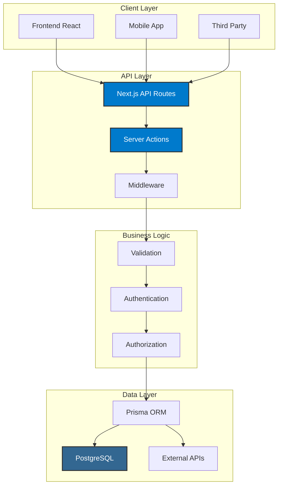

# 🔌 Documentação da API - GB-Locacoes

> **Documentação completa da API REST e Server Actions do projeto GB-Locacoes**

## 📋 Índice

- [🎯 Visão Geral](#-visão-geral)
- [🔐 Autenticação](#-autenticação)
- [📡 Endpoints](#-endpoints)
- [🛠️ Server Actions](#️-server-actions)
- [📊 Modelos de Dados](#-modelos-de-dados)
- [🔍 Exemplos de Uso](#-exemplos-de-uso)
- [⚠️ Códigos de Erro](#️-códigos-de-erro)
- [📈 Rate Limiting](#-rate-limiting)

---

## 🎯 Visão Geral

A API do GB-Locacoes é construída sobre **Next.js 16 App Router** com **API
Routes** e **Server Actions**, fornecendo uma interface RESTful completa para
gerenciamento de equipamentos, orçamentos, locações e usuários.

### 🏗️ Arquitetura da API



### 📊 Características

- **RESTful API** - Endpoints padronizados
- **TypeScript** - Tipagem completa
- **Zod Validation** - Validação de schemas
- **JWT Authentication** - Autenticação segura
- **Rate Limiting** - Proteção contra abuso
- **Error Handling** - Tratamento de erros consistente
- **Documentation** - OpenAPI/Swagger custom implementation
- **Swagger UI** - Custom interface at `/api-docs`
- **OpenAPI Spec** - Generated from JSDoc + Zod schemas

---

## 📋 **Documentação da API (Swagger/OpenAPI)**

### **🎯 Implementação Custom**

Nosso projeto usa uma **implementação custom de Swagger/OpenAPI** em vez de
bibliotecas externas como `swagger-ui-react`, devido a incompatibilidades com
React 19.

### **🔧 Como Funciona**

1. **JSDoc Comments**: Documentação inline nas rotas da API
2. **Zod Schemas**: Validação e geração automática de schemas
3. **Custom Generator**: `lib/openapi-generator.ts` gera especificação OpenAPI
4. **Custom UI**: Interface personalizada em `/api-docs`

### **📁 Arquivos de Implementação**

```typescript
// lib/openapi-generator.ts
export function generateOpenAPISpec() {
  return {
    openapi: "3.0.0",
    info: { title: "GB-Locações API", version: "1.0.0" },
    servers: [
      { url: "http://localhost:3000/api", description: "Development" },
      { url: "https://locacoesgb.com.br/api", description: "Production" }
    ]
    // ... schemas e paths
  }
}
```

### **🚀 Acesso à Documentação**

- **URL Local**: `http://localhost:3000/api-docs`
- **URL Produção**: `https://locacoesgb.com.br/api-docs`
- **Especificação**: `/openapi.json` (OpenAPI 3.0)

### **✅ Vantagens da Implementação Custom**

- **🎨 Branding**: Interface personalizada com identidade visual GB-Locações
- **🔧 Controle Total**: Sem dependências externas problemáticas
- **📱 React 19**: Compatibilidade total com versão mais recente
- **⚡ Performance**: Sem overhead de bibliotecas desnecessárias
- **🎯 Integração**: Perfeitamente integrado com nosso design system

---

## 🔐 Autenticação

### 🎫 JWT Tokens

A API utiliza **JWT (JSON Web Tokens)** para autenticação, gerenciados pelo
**NextAuth.js**.

#### **Estrutura do Token**

```json
{
  "header": {
    "alg": "HS256",
    "typ": "JWT"
  },
  "payload": {
    "sub": "user_id",
    "email": "contato@locacoesgb.com.br",
    "role": "ADMIN",
    "iat": 1640995200,
    "exp": 1641081600
  }
}
```

#### **Headers de Autenticação**

```http
Authorization: Bearer <jwt_token>
Content-Type: application/json
```

### 🔑 Roles e Permissões

| Role       | Permissões      | Endpoints                                  |
| ---------- | --------------- | ------------------------------------------ |
| **ADMIN**  | Acesso total    | Todos os endpoints                         |
| **CLIENT** | Acesso limitado | `/api/equipment`, `/api/quotes` (próprios) |

### 🛡️ Middleware de Autenticação

```typescript
// middleware.ts
import { withAuth } from "next-auth/middleware"

export default withAuth(
  function middleware(req) {
    // Lógica de middleware
  },
  {
    callbacks: {
      authorized: ({ token, req }) => {
        const { pathname } = req.nextUrl

        // Rotas públicas
        if (pathname.startsWith("/api/public")) return true

        // Rotas administrativas
        if (pathname.startsWith("/api/admin")) {
          return token?.role === "ADMIN"
        }

        // Rotas autenticadas
        return !!token
      }
    }
  }
)
```

---

## 📡 Endpoints

### 🏠 Base URL

```
Development: http://localhost:3000/api
Production:  https://locacoesgb.com.br/api
```

### 📋 Lista de Endpoints

#### **🔧 Equipamentos**

| Método   | Endpoint          | Descrição             | Autenticação |
| -------- | ----------------- | --------------------- | ------------ |
| `GET`    | `/equipment`      | Listar equipamentos   | Público      |
| `GET`    | `/equipment/[id]` | Obter equipamento     | Público      |
| `POST`   | `/equipment`      | Criar equipamento     | Admin        |
| `PUT`    | `/equipment/[id]` | Atualizar equipamento | Admin        |
| `DELETE` | `/equipment/[id]` | Excluir equipamento   | Admin        |

#### **📂 Categorias**

| Método   | Endpoint           | Descrição           | Autenticação |
| -------- | ------------------ | ------------------- | ------------ |
| `GET`    | `/categories`      | Listar categorias   | Público      |
| `GET`    | `/categories/[id]` | Obter categoria     | Público      |
| `POST`   | `/categories`      | Criar categoria     | Admin        |
| `PUT`    | `/categories/[id]` | Atualizar categoria | Admin        |
| `DELETE` | `/categories/[id]` | Excluir categoria   | Admin        |

#### **💰 Orçamentos**

| Método   | Endpoint       | Descrição           | Autenticação  |
| -------- | -------------- | ------------------- | ------------- |
| `GET`    | `/quotes`      | Listar orçamentos   | Cliente/Admin |
| `GET`    | `/quotes/[id]` | Obter orçamento     | Cliente/Admin |
| `POST`   | `/quotes`      | Criar orçamento     | Cliente       |
| `PUT`    | `/quotes/[id]` | Atualizar orçamento | Cliente/Admin |
| `DELETE` | `/quotes/[id]` | Excluir orçamento   | Admin         |

#### **🏠 Locações**

| Método   | Endpoint        | Descrição         | Autenticação  |
| -------- | --------------- | ----------------- | ------------- |
| `GET`    | `/rentals`      | Listar locações   | Cliente/Admin |
| `GET`    | `/rentals/[id]` | Obter locação     | Cliente/Admin |
| `POST`   | `/rentals`      | Criar locação     | Admin         |
| `PUT`    | `/rentals/[id]` | Atualizar locação | Admin         |
| `DELETE` | `/rentals/[id]` | Excluir locação   | Admin         |

#### **👥 Usuários**

| Método   | Endpoint      | Descrição         | Autenticação  |
| -------- | ------------- | ----------------- | ------------- |
| `GET`    | `/users`      | Listar usuários   | Admin         |
| `GET`    | `/users/[id]` | Obter usuário     | Próprio/Admin |
| `POST`   | `/users`      | Criar usuário     | Admin         |
| `PUT`    | `/users/[id]` | Atualizar usuário | Próprio/Admin |
| `DELETE` | `/users/[id]` | Excluir usuário   | Admin         |

#### **⚙️ Configurações**

| Método | Endpoint    | Descrição               | Autenticação |
| ------ | ----------- | ----------------------- | ------------ |
| `GET`  | `/settings` | Obter configurações     | Admin        |
| `PUT`  | `/settings` | Atualizar configurações | Admin        |

#### **📧 Contato**

| Método | Endpoint   | Descrição       | Autenticação |
| ------ | ---------- | --------------- | ------------ |
| `POST` | `/contact` | Enviar mensagem | Público      |

---

## 🛠️ Server Actions

### 🎯 Visão Geral

Server Actions são funções assíncronas que executam no servidor e podem ser
chamadas diretamente dos componentes React.

### 📋 Lista de Server Actions

#### **🔧 Equipamentos**

```typescript
// app/api/admin/equipments/actions.ts
export async function createEquipment(data: CreateEquipmentInput) {
  // Validação
  const validatedData = equipmentSchema.parse(data)

  // Criação
  const equipment = await prisma.equipment.create({
    data: validatedData,
    include: { category: true }
  })

  return { success: true, data: equipment }
}

export async function updateEquipment(id: string, data: UpdateEquipmentInput) {
  // Validação
  const validatedData = updateEquipmentSchema.parse({ id, ...data })

  // Atualização
  const equipment = await prisma.equipment.update({
    where: { id },
    data: validatedData,
    include: { category: true }
  })

  return { success: true, data: equipment }
}

export async function deleteEquipment(id: string) {
  // Verificação de dependências
  const hasDependencies = await prisma.quoteItem.findFirst({
    where: { equipmentId: id }
  })

  if (hasDependencies) {
    throw new Error("Equipamento possui orçamentos associados")
  }

  // Exclusão
  await prisma.equipment.delete({ where: { id } })

  return { success: true }
}
```

#### **💰 Orçamentos**

```typescript
// app/api/quotes/actions.ts
export async function createQuote(data: CreateQuoteInput) {
  // Validação
  const validatedData = quoteSchema.parse(data)

  // Cálculo do total
  const totalAmount = validatedData.items.reduce((total, item) => {
    return total + item.pricePerDay * item.quantity * item.days
  }, 0)

  // Criação
  const quote = await prisma.quote.create({
    data: {
      ...validatedData,
      totalAmount,
      items: {
        create: validatedData.items
      }
    },
    include: {
      items: {
        include: { equipment: true }
      },
      user: true
    }
  })

  return { success: true, data: quote }
}

export async function updateQuoteStatus(id: string, status: QuoteStatus) {
  const quote = await prisma.quote.update({
    where: { id },
    data: { status },
    include: {
      items: { include: { equipment: true } },
      user: true
    }
  })

  return { success: true, data: quote }
}
```

#### **⚙️ Configurações**

```typescript
// app/api/admin/settings/actions.ts
export async function updateSettings(data: SettingsInput) {
  // Validação
  const validatedData = SettingsSchema.parse(data)

  // Atualização em lote
  const updates = Object.entries(validatedData).map(([key, value]) => {
    return prisma.setting.upsert({
      where: { key },
      update: { value: JSON.stringify(value) },
      create: { key, value: JSON.stringify(value) }
    })
  })

  await prisma.$transaction(updates)

  return { success: true }
}

export async function getSettings() {
  const settings = await prisma.setting.findMany()

  const parsedSettings = settings.reduce(
    (acc, setting) => {
      acc[setting.key] = JSON.parse(setting.value)
      return acc
    },
    {} as Record<string, any>
  )

  return { success: true, data: parsedSettings }
}
```

---

## 📊 Modelos de Dados

### 🔧 Equipment

```typescript
interface Equipment {
  id: string
  name: string
  description?: string
  pricePerDay: number
  images: string[]
  available: boolean
  categoryId: string
  createdAt: Date
  updatedAt: Date
  category: Category
}

interface CreateEquipmentInput {
  name: string
  description?: string
  pricePerDay: number
  categoryId: string
  images?: string[]
  available?: boolean
}

interface UpdateEquipmentInput {
  name?: string
  description?: string
  pricePerDay?: number
  categoryId?: string
  images?: string[]
  available?: boolean
}
```

### 📂 Category

```typescript
interface Category {
  id: string
  name: string
  description?: string
  icon?: string
  iconColor: string
  bgColor: string
  fontColor: string
  slug: string
  createdAt: Date
  updatedAt: Date
  equipments: Equipment[]
}

interface CreateCategoryInput {
  name: string
  description?: string
  icon?: string
  iconColor?: string
  bgColor?: string
  fontColor?: string
  slug: string
}
```

### 💰 Quote

```typescript
interface Quote {
  id: string
  userId: string
  status: QuoteStatus
  totalAmount: number
  deliveryType: DeliveryType
  deliveryAddress?: string
  startDate: Date
  endDate: Date
  createdAt: Date
  updatedAt: Date
  user: User
  items: QuoteItem[]
  payments: Payment[]
  rentals: Rental[]
}

interface CreateQuoteInput {
  userId: string
  deliveryType: DeliveryType
  deliveryAddress?: string
  startDate: Date
  endDate: Date
  items: CreateQuoteItemInput[]
}

interface QuoteItem {
  id: string
  quoteId: string
  equipmentId: string
  quantity: number
  days: number
  pricePerDay: number
  totalPrice: number
  createdAt: Date
  equipment: Equipment
}
```

### 👥 User

```typescript
interface User {
  id: string
  name?: string
  email: string
  role: Role
  emailVerified?: Date
  image?: string
  createdAt: Date
  updatedAt: Date
  quotes: Quote[]
  rentals: Rental[]
}

enum Role {
  ADMIN = "ADMIN",
  CLIENT = "CLIENT"
}
```

### 🏠 Rental

```typescript
interface Rental {
  id: string
  quoteId: string
  userId: string
  status: RentalStatus
  startDate: Date
  endDate: Date
  totalAmount: number
  createdAt: Date
  updatedAt: Date
  quote: Quote
  user: User
  items: RentalItem[]
  payments: Payment[]
}

interface RentalItem {
  id: string
  rentalId: string
  equipmentId: string
  quantity: number
  days: number
  pricePerDay: number
  totalPrice: number
  status: RentalItemStatus
  createdAt: Date
  equipment: Equipment
}
```

---

## 🔍 Exemplos de Uso

### 📡 REST API

#### **Listar Equipamentos**

```bash
curl -X GET "http://localhost:3000/api/equipment" \
  -H "Content-Type: application/json"
```

**Resposta:**

```json
{
  "success": true,
  "data": [
    {
      "id": "equipment_1",
      "name": "Escavadeira Hidráulica",
      "description": "Escavadeira para obras de grande porte",
      "pricePerDay": 1500.0,
      "images": ["image1.jpg", "image2.jpg"],
      "available": true,
      "categoryId": "category_1",
      "category": {
        "id": "category_1",
        "name": "Escavadeiras",
        "slug": "escavadeiras"
      }
    }
  ],
  "pagination": {
    "page": 1,
    "limit": 20,
    "total": 50,
    "pages": 3
  }
}
```

#### **Criar Orçamento**

```bash
curl -X POST "http://localhost:3000/api/quotes" \
  -H "Authorization: Bearer <jwt_token>" \
  -H "Content-Type: application/json" \
  -d '{
    "deliveryType": "DELIVERY",
    "deliveryAddress": "Rua das Flores, 123",
    "startDate": "2024-01-15T00:00:00Z",
    "endDate": "2024-01-20T00:00:00Z",
    "items": [
      {
        "equipmentId": "equipment_1",
        "quantity": 1,
        "days": 5,
        "pricePerDay": 1500.00
      }
    ]
  }'
```

**Resposta:**

```json
{
  "success": true,
  "data": {
    "id": "quote_1",
    "userId": "user_1",
    "status": "PENDING",
    "totalAmount": 7500.0,
    "deliveryType": "DELIVERY",
    "deliveryAddress": "Rua das Flores, 123",
    "startDate": "2024-01-15T00:00:00Z",
    "endDate": "2024-01-20T00:00:00Z",
    "items": [
      {
        "id": "quote_item_1",
        "equipmentId": "equipment_1",
        "quantity": 1,
        "days": 5,
        "pricePerDay": 1500.0,
        "totalPrice": 7500.0,
        "equipment": {
          "name": "Escavadeira Hidráulica"
        }
      }
    ]
  }
}
```

### 🛠️ Server Actions

#### **Criar Equipamento (Admin)**

```typescript
// Componente React
'use client'

import { createEquipment } from '@/app/api/admin/equipments/actions'

export function CreateEquipmentForm() {
  const handleSubmit = async (formData: FormData) => {
    const data = {
      name: formData.get('name') as string,
      description: formData.get('description') as string,
      pricePerDay: Number(formData.get('pricePerDay')),
      categoryId: formData.get('categoryId') as string,
    }

    try {
      const result = await createEquipment(data)
      if (result.success) {
        // Sucesso
        toast.success('Equipamento criado com sucesso!')
      }
    } catch (error) {
      // Erro
      toast.error('Erro ao criar equipamento')
    }
  }

  return (
    <form action={handleSubmit}>
      <input name="name" placeholder="Nome do equipamento" required />
      <textarea name="description" placeholder="Descrição" />
      <input name="pricePerDay" type="number" placeholder="Preço por dia" required />
      <select name="categoryId" required>
        <option value="">Selecione uma categoria</option>
        {/* Opções */}
      </select>
      <button type="submit">Criar Equipamento</button>
    </form>
  )
}
```

#### **Atualizar Configurações**

```typescript
// Componente React
'use client'

import { updateSettings } from '@/app/api/admin/settings/actions'

export function SettingsForm({ settings }: { settings: Settings }) {
  const handleSubmit = async (formData: FormData) => {
    const data = {
      companyPhone: formData.get('companyPhone') as string,
      companyAddress: formData.get('companyAddress') as string,
      contactEmail: formData.get('contactEmail') as string,
      themeColorPrimary: formData.get('themeColorPrimary') as string,
    }

    try {
      const result = await updateSettings(data)
      if (result.success) {
        toast.success('Configurações atualizadas!')
      }
    } catch (error) {
      toast.error('Erro ao atualizar configurações')
    }
  }

  return (
    <form action={handleSubmit}>
      <input
        name="companyPhone"
        defaultValue={settings.companyPhone}
        placeholder="Telefone da empresa"
      />
      <input
        name="companyAddress"
        defaultValue={settings.companyAddress}
        placeholder="Endereço da empresa"
      />
      <input
        name="contactEmail"
        defaultValue={settings.contactEmail}
        placeholder="Email de contato"
      />
      <input
        name="themeColorPrimary"
        defaultValue={settings.themeColorPrimary}
        type="color"
      />
      <button type="submit">Salvar Configurações</button>
    </form>
  )
}
```

---

## ⚠️ Códigos de Erro

### 📊 Códigos HTTP

| Código | Descrição             | Exemplo                        |
| ------ | --------------------- | ------------------------------ |
| `200`  | Sucesso               | Operação realizada com sucesso |
| `201`  | Criado                | Recurso criado com sucesso     |
| `400`  | Bad Request           | Dados inválidos ou malformados |
| `401`  | Unauthorized          | Token inválido ou ausente      |
| `403`  | Forbidden             | Sem permissão para acessar     |
| `404`  | Not Found             | Recurso não encontrado         |
| `409`  | Conflict              | Conflito de dados              |
| `422`  | Unprocessable Entity  | Validação falhou               |
| `429`  | Too Many Requests     | Rate limit excedido            |
| `500`  | Internal Server Error | Erro interno do servidor       |

### 🔍 Estrutura de Erro

```json
{
  "success": false,
  "error": {
    "code": "VALIDATION_ERROR",
    "message": "Dados inválidos",
    "details": [
      {
        "field": "email",
        "message": "Email inválido"
      },
      {
        "field": "pricePerDay",
        "message": "Preço deve ser positivo"
      }
    ]
  }
}
```

### 📋 Códigos de Erro Específicos

| Código                     | Descrição                  | Solução                   |
| -------------------------- | -------------------------- | ------------------------- |
| `INVALID_TOKEN`            | Token JWT inválido         | Renovar token             |
| `INSUFFICIENT_PERMISSIONS` | Permissões insuficientes   | Verificar role            |
| `RESOURCE_NOT_FOUND`       | Recurso não encontrado     | Verificar ID              |
| `VALIDATION_ERROR`         | Erro de validação          | Verificar dados           |
| `DUPLICATE_ENTRY`          | Entrada duplicada          | Usar dados únicos         |
| `DEPENDENCY_ERROR`         | Dependência não satisfeita | Verificar relacionamentos |

---

## 📈 Rate Limiting

### 🛡️ Proteção contra Abuso

A API implementa **rate limiting** para proteger contra abuso e garantir
performance.

#### **Limites por Endpoint**

| Endpoint         | Limite       | Janela     |
| ---------------- | ------------ | ---------- |
| `/api/equipment` | 100 requests | 15 minutos |
| `/api/quotes`    | 50 requests  | 15 minutos |
| `/api/contact`   | 10 requests  | 15 minutos |
| `/api/admin/*`   | 200 requests | 15 minutos |

#### **Headers de Rate Limiting**

```http
X-RateLimit-Limit: 100
X-RateLimit-Remaining: 95
X-RateLimit-Reset: 1640995200
```

#### **Resposta de Rate Limit Excedido**

```json
{
  "success": false,
  "error": {
    "code": "RATE_LIMIT_EXCEEDED",
    "message": "Too many requests. Please try again later.",
    "retryAfter": 900
  }
}
```

### 🔧 Implementação

```typescript
// lib/rate-limit.ts
import { NextRequest, NextResponse } from "next/server"

const rateLimit = new Map()

export function rateLimitMiddleware(request: NextRequest) {
  const ip = request.ip || "unknown"
  const pathname = request.nextUrl.pathname
  const now = Date.now()
  const windowMs = 15 * 60 * 1000 // 15 minutos

  // Limites por endpoint
  const limits = {
    "/api/equipment": 100,
    "/api/quotes": 50,
    "/api/contact": 10,
    "/api/admin": 200
  }

  const limit = limits[pathname] || 100
  const key = `${ip}:${pathname}`

  const userRequests = rateLimit.get(key) || []
  const validRequests = userRequests.filter(
    (timestamp: number) => now - timestamp < windowMs
  )

  if (validRequests.length >= limit) {
    return NextResponse.json(
      {
        success: false,
        error: {
          code: "RATE_LIMIT_EXCEEDED",
          message: "Too many requests. Please try again later.",
          retryAfter: Math.ceil(windowMs / 1000)
        }
      },
      {
        status: 429,
        headers: {
          "X-RateLimit-Limit": limit.toString(),
          "X-RateLimit-Remaining": "0",
          "X-RateLimit-Reset": (now + windowMs).toString(),
          "Retry-After": Math.ceil(windowMs / 1000).toString()
        }
      }
    )
  }

  validRequests.push(now)
  rateLimit.set(key, validRequests)

  const response = NextResponse.next()
  response.headers.set("X-RateLimit-Limit", limit.toString())
  response.headers.set(
    "X-RateLimit-Remaining",
    (limit - validRequests.length).toString()
  )
  response.headers.set("X-RateLimit-Reset", (now + windowMs).toString())

  return response
}
```

---

## 📚 Conclusão

Esta documentação fornece uma visão completa da API do GB-Locacoes, incluindo:

- **Endpoints RESTful** - Interface padronizada
- **Server Actions** - Funções assíncronas
- **Autenticação JWT** - Segurança robusta
- **Validação Zod** - Dados confiáveis
- **Rate Limiting** - Proteção contra abuso
- **Tratamento de Erros** - Respostas consistentes

Para mais informações sobre implementação específica, consulte os arquivos de
código fonte e a documentação técnica do projeto.
