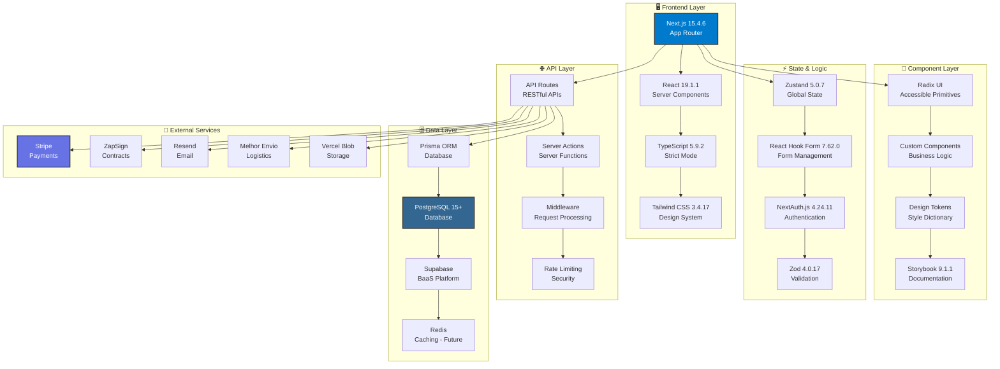
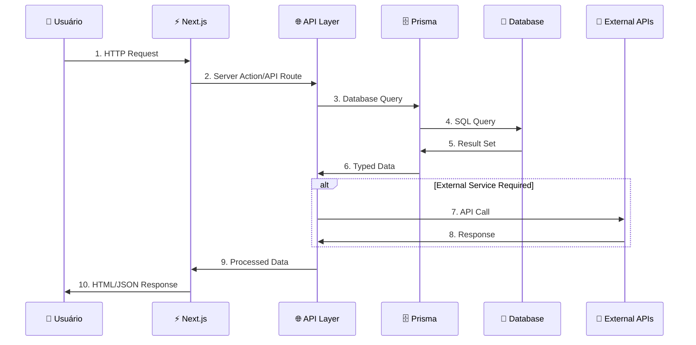
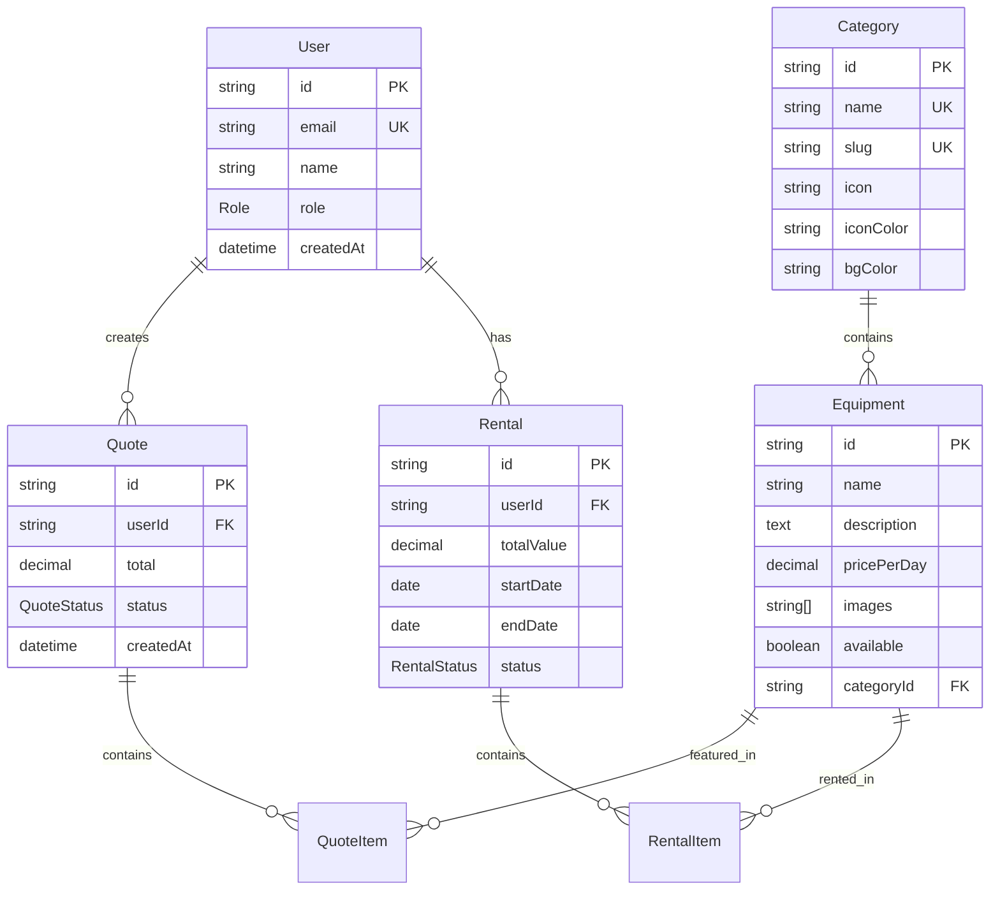

# 🏗️ Visão Geral da Arquitetura - GB Locações

> **Documentação técnica completa da arquitetura do sistema GB-Locações**

## 📋 Índice

- [🎯 Visão Geral](#-visão-geral)
- [🏛️ Arquitetura do Sistema](#️-arquitetura-do-sistema)
- [🔄 Fluxo de Dados](#-fluxo-de-dados)
- [📊 Tecnologias Principais](#-tecnologias-principais)
- [🗄️ Modelo de Dados](#️-modelo-de-dados)
- [🔌 Integrações Externas](#-integrações-externas)
- [📦 Estrutura de Módulos](#-estrutura-de-módulos)

---

## 🎯 Visão Geral

O **GB-Locações** é uma plataforma moderna de locação de equipamentos construída
com arquitetura **full-stack TypeScript**, seguindo os padrões mais atuais de
desenvolvimento web.

### 🎯 **Princípios Arquiteturais**

- **🏗️ Arquitetura Limpa** - Separação clara de responsabilidades
- **⚡ Performance First** - Otimizado para Core Web Vitals
- **🔐 Seguro por Design** - Segurança em todas as camadas
- **📱 Mobile First** - Experiência mobile prioritária
- **♿ Acessível** - WCAG 2.1 AA compliance
- **🧪 Testável** - Cobertura de testes abrangente

---

## 🏛️ Arquitetura do Sistema

### **Stack Tecnológico Moderno**



### **Camadas da Aplicação**

#### **1. 🖥️ Presentation Layer**

- **Next.js App Router** - Roteamento file-based e Server Components
- **React 19** - Biblioteca de UI com concurrent features
- **TypeScript** - Tipagem estática e IntelliSense
- **Tailwind CSS** - Framework CSS utility-first

#### **2. 🧩 Component Layer**

- **Radix UI** - Componentes primitivos acessíveis
- **Custom Components** - Componentes específicos do negócio
- **Design System** - Sistema de design tokens consistente
- **Storybook** - Documentação visual de componentes

#### **3. ⚡ Business Logic Layer**

- **Server Actions** - Funções server-side para mutations
- **API Routes** - Endpoints RESTful para dados
- **Custom Hooks** - Lógica de estado reutilizável
- **Validation** - Schemas Zod para validação de dados

#### **4. 🗄️ Data Access Layer**

- **Prisma ORM** - Type-safe database client
- **PostgreSQL** - Banco relacional principal
- **Supabase** - Backend-as-a-Service
- **Caching Strategy** - Redis para cache (futuro)

#### **5. 🔌 Integration Layer**

- **Payment Gateway** - Stripe para pagamentos
- **Document Signing** - ZapSign para contratos
- **Email Service** - Resend para transacional
- **Logistics** - Melhor Envio para cálculo de frete
- **File Storage** - Vercel Blob e Supabase Storage

---

## 🔄 Fluxo de Dados

### **Request/Response Flow**



### **Data Flow Patterns**

#### **📖 Read Operations (Queries)**

```typescript
// 1. Component Request
const equipments = await getEquipments()

// 2. Server Action/API Route
export async function getEquipments() {
  const { prisma } = await import("@/lib/prisma")
  return prisma.equipment.findMany({
    include: { category: true }
  })
}

// 3. Prisma Query → Database
// 4. Typed Response
```

#### **✏️ Write Operations (Mutations)**

```typescript
// 1. Form Submission
const result = await createEquipment(formData)

// 2. Validation
const validated = equipmentSchema.parse(formData)

// 3. Database Transaction
await prisma.$transaction([
  prisma.equipment.create(data),
  prisma.auditLog.create(audit)
])

// 4. Response/Redirect
```

---

## 📊 Tecnologias Principais

### **🎯 Versões Estáveis (Testadas)**

| Categoria         | Tecnologia      | Versão      | Status       | Notas               |
| ----------------- | --------------- | ----------- | ------------ | ------------------- |
| **Framework**     | Next.js         | 15.4.6      | ✅ Estável   | App Router completo |
| **UI Library**    | React           | 19.1.1      | ✅ Estável   | Server Components   |
| **Language**      | TypeScript      | 5.9.2       | ✅ Estável   | Strict mode         |
| **Database**      | PostgreSQL      | 15+         | ✅ Estável   | JSON, Indexes       |
| **ORM**           | Prisma          | **Estável** | ✅ Funcional | Versão atual        |
| **Styling**       | Tailwind CSS    | **3.4.17**  | ⚠️ Travado   | NÃO atualizar       |
| **UI Components** | Radix UI        | Latest      | ✅ Estável   | Atualizável         |
| **State**         | Zustand         | 5.0.7       | ✅ Estável   | Global state        |
| **Forms**         | React Hook Form | 7.62.0      | ✅ Estável   | Performance         |
| **Validation**    | Zod             | 4.0.17      | ✅ Estável   | Type inference      |
| **Auth**          | NextAuth.js     | 4.24.11     | ✅ Estável   | JWT + Database      |
| **Testing**       | Vitest          | 3.2.4       | ✅ Estável   | Fast testing        |
| **E2E**           | Playwright      | 1.54.2      | ✅ Estável   | Cross-browser       |

### **⚠️ Incompatibilidades Críticas**

```bash
# ❌ BLOQUEADORES - NÃO ATUALIZAR
Prisma 6.14.0+ → Erro "did not initialize yet"
Tailwind CSS 4.x → Quebra design system

# ✅ SEGURO ATUALIZAR
@radix-ui/react-* → Sempre compatível
@testing-library/* → Sempre compatível
date-fns → Sempre compatível
lucide-react → Sempre compatível
```

---

## 🗄️ Modelo de Dados

### **📊 Entidades Principais**



### **🔗 Relacionamentos**

#### **User Relations**

- `User → Quote` (1:N) - Um usuário pode criar múltiplos orçamentos
- `User → Rental` (1:N) - Um usuário pode ter múltiplas locações

#### **Equipment Relations**

- `Category → Equipment` (1:N) - Uma categoria tem múltiplos equipamentos
- `Equipment → QuoteItem` (1:N) - Um equipamento pode estar em múltiplos
  orçamentos
- `Equipment → RentalItem` (1:N) - Um equipamento pode ser locado múltiplas
  vezes

#### **Business Relations**

- `Quote → QuoteItem` (1:N) - Um orçamento contém múltiplos itens
- `Rental → RentalItem` (1:N) - Uma locação contém múltiplos itens

### **📝 Schemas Principais**

```typescript
// User Schema
export const userSchema = z.object({
  name: z.string().min(2, "Nome deve ter pelo menos 2 caracteres"),
  email: z.string().email("Email inválido"),
  role: z.enum(["ADMIN", "CLIENT"]).default("CLIENT")
})

// Equipment Schema
export const equipmentSchema = z.object({
  name: z.string().min(1, "Nome é obrigatório"),
  description: z.string().optional(),
  pricePerDay: z.number().positive("Preço deve ser positivo"),
  categoryId: z.string().uuid("Categoria inválida"),
  images: z.array(z.string().url()).default([]),
  available: z.boolean().default(true)
})

// Quote Schema
export const quoteSchema = z.object({
  items: z
    .array(
      z.object({
        equipmentId: z.string().uuid(),
        quantity: z.number().int().positive(),
        days: z.number().int().positive()
      })
    )
    .min(1, "Pelo menos um item é obrigatório")
})
```

---

## 🔌 Integrações Externas

### **💳 Payments - Stripe**

```typescript
// Stripe Integration
export const stripe = new Stripe(process.env.STRIPE_SECRET_KEY!, {
  apiVersion: "2023-10-16"
})

// Payment Intent Creation
const paymentIntent = await stripe.paymentIntents.create({
  amount: total * 100, // cents
  currency: "brl",
  metadata: { quoteId: quote.id }
})
```

### **📄 Contracts - ZapSign**

```typescript
// Document Signing
export const zapSign = new ZapSign({
  apiKey: process.env.ZAPSIGN_TOKEN!,
  sandbox: process.env.NODE_ENV !== "production"
})

// Contract Creation
const contract = await zapSign.createDocument({
  templateId: "rental-contract",
  variables: { customerName, equipmentList, total }
})
```

### **📧 Email - Resend**

```typescript
// Transactional Email
export const resend = new Resend(process.env.RESEND_API_KEY!)

// Send Quote Email
await resend.emails.send({
  from: "noreply@gblocacoes.com.br",
  to: customer.email,
  subject: "Seu orçamento GB Locações",
  react: QuoteEmailTemplate({ quote, customer })
})
```

### **🚚 Logistics - Melhor Envio**

```typescript
// Shipping Calculation
export const melhorEnvio = new MelhorEnvio({
  token: process.env.MELHOR_ENVIO_TOKEN!,
  sandbox: process.env.NODE_ENV !== "production"
})

// Calculate Shipping
const shipping = await melhorEnvio.calculate({
  from: { postal_code: "01310-100" },
  to: { postal_code: customer.postalCode },
  dimensions: equipmentDimensions
})
```

### **☁️ Storage - Supabase + Vercel Blob**

```typescript
// File Upload Strategy
export async function uploadFile(file: File) {
  // Small files → Vercel Blob (fast)
  if (file.size < 4.5 * 1024 * 1024) {
    return await put(file.name, file, {
      access: "public",
      token: process.env.BLOB_READ_WRITE_TOKEN
    })
  }

  // Large files → Supabase Storage (cost-effective)
  return await supabase.storage.from("equipment-images").upload(file.name, file)
}
```

---

## 📦 Estrutura de Módulos

### **🗂️ Organização de Diretórios**

```
src/
├── 📁 app/                     # Next.js App Router
│   ├── 📁 admin/              # Admin panel pages
│   ├── 📁 api/                # API routes
│   ├── 📁 (auth)/             # Auth pages group
│   └── 📁 (public)/           # Public pages group
├── 📁 components/             # React components
│   ├── 📁 ui/                 # Base UI components
│   ├── 📁 admin/              # Admin-specific components
│   └── 📁 forms/              # Form components
├── 📁 lib/                    # Utilities & configs
│   ├── 📁 validators/         # Zod schemas
│   ├── 📁 integrations/       # External service clients
│   └── 📄 utils.ts            # Shared utilities
├── 📁 hooks/                  # Custom React hooks
├── 📁 types/                  # TypeScript definitions
├── 📁 schemas/                # Database schemas
└── 📁 prisma/                 # Database files
```

### **🔧 Padrões de Módulos**

#### **Feature Module Pattern**

```typescript
// features/equipment/
├── components/
│   ├── EquipmentCard.tsx
│   ├── EquipmentForm.tsx
│   └── EquipmentList.tsx
├── hooks/
│   ├── useEquipment.ts
│   └── useEquipmentForm.ts
├── schemas/
│   └── equipment.schema.ts
└── types/
    └── equipment.types.ts
```

#### **Shared Module Pattern**

```typescript
// shared/
├── components/
│   ├── LoadingSpinner.tsx
│   ├── ErrorBoundary.tsx
│   └── PageHeader.tsx
├── utils/
│   ├── format.ts
│   ├── validation.ts
│   └── api.ts
└── constants/
    ├── routes.ts
    └── config.ts
```

---

## 🔗 Próximos Passos

Para entender aspectos específicos da arquitetura:

- **[database.md](./database.md)** - Estrutura detalhada do banco
- **[api.md](./api.md)** - Documentação completa das APIs
- **[security.md](./security.md)** - Aspectos de segurança
- **[../features/design-system.md](../features/design-system.md)** - Sistema de
  design

---

_Última atualização: dezembro 2024_
