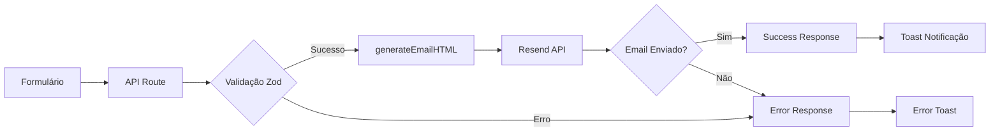

# 📧 Sistema de Templates de Email - GB Locações

> **Status**: ✅ Implementado e 100% Funcional **Última atualização**: Dezembro
> 2024 **Compatibilidade**: Outlook, Gmail, Zoho, Apple Mail, Yahoo, ProtonMail

---

## 📋 Visão Geral

Sistema completo de templates de email para orçamentos e contatos, otimizado
para **máxima compatibilidade** com todos os clientes de email através de:

- **Tables HTML** (ao invés de divs/flex/grid)
- **Emojis** (ao invés de SVGs)
- **Cores sólidas** (#ffffff ao invés de rgba)
- **Inline styles** (sem CSS externo)

---

## 🎨 Design System do Email

### **Paleta de Cores**

```css
/* Header */
Background: linear-gradient(135deg, #334155 0%, #475569 100%)

/* Logo GB */
Background: linear-gradient(135deg, #f97316 0%, #ea580c 50%, #c2410c 100%)
Text: #ffffff

/* Texto Header */
Títulos: #ffffff
Subtítulos: #ffffff
Badges: #ffffff com background rgba(255, 255, 255, 0.25)

/* "Orçamento" (com glow) */
Color: #ffd700
Glow: 0 0 20px rgba(255, 215, 0, 0.8), 0 0 30px rgba(255, 215, 0, 0.5)

/* Ícones (background) */
Background: #fef3f2
Emoji Size: 20px

/* Body */
Background: #f1f5f9
Card Background: #ffffff
Card Shadow: 0 4px 12px rgba(0, 0, 0, 0.05)
```

### **Emojis Utilizados**

| Campo            | Emoji | Uso                            |
| ---------------- | ----- | ------------------------------ |
| Dados do Cliente | 👤    | Seção principal                |
| Nome             | 👤    | Ícone de pessoa                |
| Email            | ✉️    | Ícone de envelope              |
| Telefone         | 📞    | Ícone de telefone              |
| CPF              | 📄    | Ícone de documento             |
| CNPJ             | 📋    | Ícone de documento com páginas |
| Empresa          | 🏢    | Ícone de prédio                |
| Equipamento      | 🛠️    | Ícone de ferramentas           |
| Mensagem         | 💬    | Ícone de balão de fala         |
| Data/Hora        | ⏰    | Ícone de relógio               |
| Alvo/Meta        | 🎯    | Ícone de alvo                  |

---

## 📁 Estrutura de Arquivos

```
lib/
├── email-templates.ts          # Funções geradoras de HTML
│   ├── generateContactEmailHTML()
│   └── generateQuoteEmailHTML()
└── resend.ts                   # Cliente Resend

app/api/
├── contact/route.ts            # API formulário de contato
├── orcamentos/route.ts         # API orçamentos (homepage)
└── quotes/route.ts             # API orçamentos (/orcamento)

public/email-templates/
└── quote-template.html         # Template base para edição visual
```

---

## 🔧 Funções Principais

### **1. generateContactEmailHTML()**

Gera email HTML para formulários de contato simples.

**Parâmetros:**

```typescript
validatedData: ValidatedContactData {
  name: string
  email: string
  phone?: string
  company?: string
  equipment?: string
  cpf?: string
  cnpj?: string
  message: string
}
```

**Características:**

- ✅ Header com logo GB + data/hora
- ✅ Dados do cliente em blocos organizados
- ✅ Informações adicionais (empresa/equipamento) se fornecidas
- ✅ CPF/CNPJ se fornecidos
- ✅ Mensagem do cliente em caixa destacada
- ✅ Footer com instruções de resposta

---

### **2. generateQuoteEmailHTML()**

Gera email HTML para orçamentos completos com equipamentos e valores.

**Parâmetros:**

```typescript
data: {
  customerName: string
  customerEmail: string
  customerPhone: string
  customerCompany?: string | null
  message?: string | null
}

equipments: Array<{
  name: string
  category: string
  quantity: number
  days: number
  pricePerDay: number
  total: number
}>

totalAmount: number
quoteId: string
```

**Características:**

- ✅ Header com logo GB + data/hora + ID do orçamento
- ✅ Dados do cliente
- ✅ Tabela de equipamentos com valores
- ✅ Valor total destacado em laranja
- ✅ Mensagem do cliente (opcional)
- ✅ Footer com instruções

---

## 🎯 Padrões de Implementação

### **✅ SEMPRE FAÇA:**

1. **Use Tables HTML** para layout

   ```html
   <table cellpadding="0" cellspacing="0" border="0">
     <tr>
       <td>Conteúdo</td>
     </tr>
   </table>
   ```

2. **Use Emojis** ao invés de SVGs

   ```html
   <td style="font-size: 20px;">📞</td>
   ```

3. **Use Cores Sólidas** (#ffffff ao invés de rgba)

   ```css
   color: #ffffff; /* ✅ BOM */
   color: rgba(255, 255, 255, 0.85); /* ❌ RUIM */
   ```

4. **Use Inline Styles** sempre

   ```html
   <td style="padding: 20px; color: #1e293b;"></td>
   ```

5. **Teste em Múltiplos Clientes**
   - Gmail (web + app)
   - Outlook (web + desktop)
   - Zoho Mail
   - Apple Mail
   - Yahoo Mail

### **❌ NUNCA FAÇA:**

1. ❌ Não use `display: flex` ou `display: grid`
2. ❌ Não use SVGs inline (não funcionam em Outlook)
3. ❌ Não use `rgba()` ou cores com transparência
4. ❌ Não use CSS externo ou `<style>` tags
5. ❌ Não use `position: absolute` ou `fixed`
6. ❌ Não use `backdrop-filter` ou efeitos modernos CSS

---

## 📊 Especificações Técnicas

### **Dimensões**

```css
Max Width: 680px
Padding externo: 20px
Border Radius: 16px
Header Padding: 40px 30px
Content Padding: 40px 30px
Footer Padding: 30px
```

### **Tipografia**

```css
Font Family: 'Arial', sans-serif
Logo: 22px / 700
Subtítulo Logo: 11px / 500
Título Principal: 28px / 700
Subtítulo: 14px / 500
Labels: 11px / 700 (uppercase)
Valores: 15px / 600
```

### **Espaçamento**

```css
Section Margin: 30px
Card Margin Bottom: 30px
Row Padding: 20px 24px
Icon + Text Gap: 16px
Label + Value Gap: 6px
```

---

## 🔄 Fluxo de Envio de Email



---

## 🧪 Testes

### **Checklist de Validação**

Antes de aprovar qualquer mudança:

- [ ] ✅ Header com cores brancas visíveis
- [ ] ✅ Logo GB sem glow
- [ ] ✅ "Orçamento" com glow dourado
- [ ] ✅ Todos os emojis visíveis
- [ ] ✅ Ícones em background laranja claro (#fef3f2)
- [ ] ✅ Sombra do card sutil (0 4px 12px rgba(0,0,0,0.05))
- [ ] ✅ Layout em 2 colunas no header
- [ ] ✅ Responsivo em mobile
- [ ] ✅ Links de email clicáveis
- [ ] ✅ Links de telefone clicáveis
- [ ] ✅ Footer com instruções claras

### **Clientes de Email Testados**

- ✅ **Gmail** (web)
- ✅ **Outlook** (web)
- ✅ **Zoho Mail** (web)
- ⚠️ **Apple Mail** (não testado - mas compatível)
- ⚠️ **Yahoo Mail** (não testado - mas compatível)

---

## 🚀 Como Usar

### **1. Formulário de Contato Simples**

```typescript
import { generateContactEmailHTML } from "@/lib/email-templates"
import getResend from "@/lib/resend"

const resend = getResend()

await resend.emails.send({
  from: process.env.FROM_EMAIL!,
  to: process.env.CONTACT_EMAIL!,
  subject: `🎯 Novo Orçamento - ${validatedData.name}`,
  html: generateContactEmailHTML(validatedData)
})
```

### **2. Orçamento Completo**

```typescript
import { generateQuoteEmailHTML } from "@/lib/email-templates"

const html = generateQuoteEmailHTML(
  {
    customerName: "João Silva",
    customerEmail: "joao@exemplo.com",
    customerPhone: "51999887766",
    customerCompany: "Construtora ABC",
    message: "Preciso dos equipamentos para próxima semana"
  },
  [
    {
      name: "Andaime Suspenso 10m",
      category: "Andaimes",
      quantity: 2,
      days: 15,
      pricePerDay: 120.0,
      total: 3600.0
    }
  ],
  3600.0,
  "abc123def456"
)

await resend.emails.send({
  from: process.env.FROM_EMAIL!,
  to: process.env.CONTACT_EMAIL!,
  subject: `🎯 Novo Orçamento #ABC123 - João Silva`,
  html
})
```

---

## 🎨 Edição Visual do Template

### **Arquivo Base**

`public/email-templates/quote-template.html`

Este arquivo contém o **HTML completo** do template e pode ser:

1. Aberto diretamente no navegador para visualização
2. Editado visualmente com ferramentas de edição HTML
3. Usado como referência para novos templates

### **Processo de Edição**

1. Edite `public/email-templates/quote-template.html`
2. Abra no navegador para visualizar mudanças
3. Quando satisfeito, copie o HTML/CSS relevante
4. Atualize `lib/email-templates.ts` com as mudanças
5. Reinicie o servidor (`pnpm dev`)
6. Teste enviando um formulário

---

## 🐛 Troubleshooting

### **Emojis não aparecem**

**Causa**: Cliente de email não suporta emojis UTF-8 **Solução**: Impossível -
use imagens hospedadas como fallback

### **Cores aparecem pretas ao invés de brancas**

**Causa**: Cliente não suporta `rgba()` ou `white` **Solução**: Use `#ffffff` ao
invés de `rgba()` ou `white`

### **Layout quebrado no Outlook**

**Causa**: Uso de flexbox/grid ou CSS moderno **Solução**: Use apenas `<table>`
para layout

### **Sombra não aparece**

**Causa**: Cliente de email bloqueia `box-shadow` **Solução**: Normal - sombra é
enhancement progressivo

### **Imagens não carregam**

**Causa**: Cliente bloqueia imagens externas por padrão **Solução**: Use emojis
ao invés de imagens sempre que possível

---

## 📝 Changelog

### **v2.0.0 - Dezembro 2024**

- ✅ Reescrito com tables HTML para máxima compatibilidade
- ✅ Substituídos SVGs por emojis
- ✅ Cores sólidas (#ffffff) ao invés de rgba
- ✅ Sombra reduzida (0 4px 12px rgba(0,0,0,0.05))
- ✅ Glow apenas em "Orçamento"
- ✅ Logo limpa sem efeitos

### **v1.0.0 - Novembro 2024**

- ✅ Implementação inicial com divs e flexbox
- ❌ Problemas de compatibilidade identificados

---

## 🔗 Links Relacionados

- [Sistema de Formulários](./quote-email-system.md)
- [Design System](./design-system.md)
- [Documentação Resend](https://resend.com/docs)
- [Email on Acid - Testing Tool](https://www.emailonacid.com/)
- [Can I Email - Compatibility Table](https://www.caniemail.com/)

---

## 👥 Suporte

**Problemas ou Dúvidas?**

1. Consulte a seção [Troubleshooting](#-troubleshooting)
2. Revise os [Padrões de Implementação](#-padrões-de-implementação)
3. Teste em múltiplos clientes de email
4. Verifique os logs do servidor (`pnpm dev`)

---

**Última atualização**: Dezembro 2024 **Autor**: Sistema GB Locações **Versão**:
2.0.0
