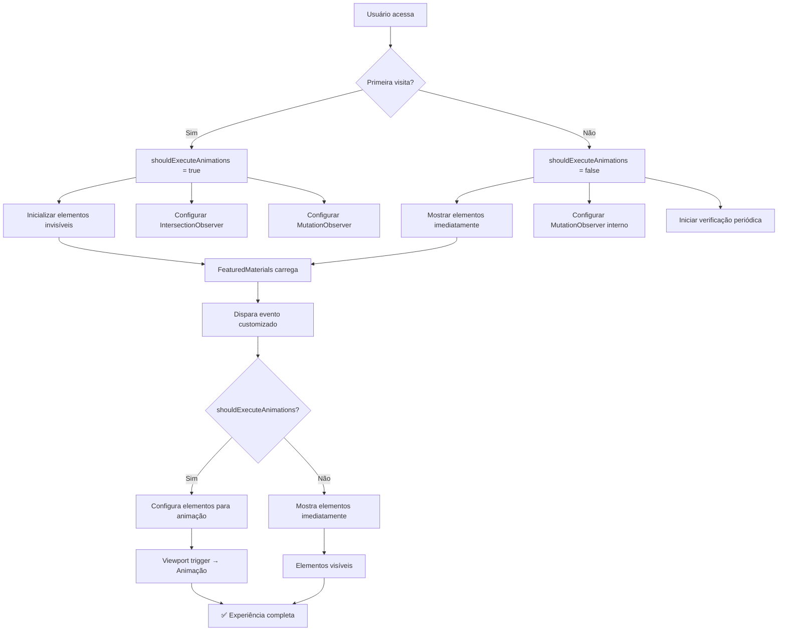

# 🎬 Sistema de Scroll Reveal - GB Locações

## 📋 Visão Geral

O sistema de scroll reveal do GB Locações implementa animações inteligentes que
respeitam o comportamento do usuário:

- **Primeira visita**: Animações suaves para impressionar
- **Navegação interna**: Elementos aparecem instantaneamente para fluidez

## 🏗️ Arquitetura

### Componentes Principais

```
scroll-reveal-init.tsx     # Sistema global de controle
featured-materials.tsx     # Componente com elementos dinâmicos
home-page-client.tsx      # Carregamento dinâmico de componentes
header.tsx                # Marcação de navegação interna
```

## 🧠 Lógica de Funcionamento

### 1. Detecção de Tipo de Navegação

```typescript
const isInternalNavigation = () => {
  const navigationType = getNavigationType()
  const wasInternalClick =
    sessionStorage.getItem("internalNavigation") === "true"

  return (
    wasInternalClick ||
    (navigationType === "navigate" &&
      sessionStorage.getItem("hasVisitedSite") === "true")
  )
}
```

**Primeira visita detectada quando:**

- URL digitada diretamente
- Refresh da página
- Nova aba/janela
- Primeira vez no domínio

**Navegação interna detectada quando:**

- Clique em link interno (marcado no header.tsx)
- Navegação pelo histórico do browser
- Usuário já visitou o site anteriormente

### 2. Elementos Suportados

```typescript
const selectors =
  ".hero-title, .hero-subtitle, .hero-search, .hero-buttons, .hero-contact, .hero-image, " +
  ".section-title, .section-subtitle, .category-card, .material-card, .benefit-card, " +
  ".contact-form, .contact-info, .cta-section, .animate-on-scroll, .animate-on-scroll-delayed, .category-card-animate"
```

### 3. Animações Aplicadas

| Elemento            | Animação    | Delay               | Duração |
| ------------------- | ----------- | ------------------- | ------- |
| `.hero-title`       | slideInLeft | 0.2s                | 1.2s    |
| `.hero-subtitle`    | slideInLeft | 0.4s                | 1.0s    |
| `.section-title`    | slideInUp   | 0.2s                | 0.8s    |
| `.section-subtitle` | slideInUp   | 0.4s                | 0.6s    |
| `.category-card`    | slideInUp   | 0.2s + index\*0.15s | 0.8s    |
| `.material-card`    | slideInUp   | 0.3s + index\*0.15s | 0.8s    |
| `.benefit-card`     | slideInUp   | 0.2s + index\*0.15s | 0.7s    |

## 🎯 Comportamentos por Cenário

### Primeira Visita (`shouldExecuteAnimations = true`)

1. **Inicialização**:

   ```typescript
   element.style.opacity = "0"
   element.style.transform = "translateY(60px)"
   element.style.transition = "none"
   ```

2. **Animação no Viewport**:

   ```typescript
   element.style.animation = "slideInUp 0.8s ease-out 0.2s forwards"
   ```

3. **Observadores Ativos**:
   - IntersectionObserver para viewport
   - MutationObserver para novos elementos

### Navegação Interna (`shouldExecuteAnimations = false`)

1. **Exibição Imediata**:

   ```typescript
   element.style.opacity = "1"
   element.style.transform = "translateY(0)"
   element.style.animation = "none"
   element.style.transition = "none"
   ```

2. **Sistemas de Backup**:
   - MutationObserver para novos elementos
   - Verificação periódica (500ms)
   - Delay maior (200ms) para carregamento

## 🔧 Elementos Dinâmicos

### Problema dos Componentes Assíncronos

Componentes carregados com `ssr: false` + API calls não existem quando o sistema
global inicializa.

**Solução**: Sistema de eventos customizados

### Implementação no FeaturedMaterials

```typescript
// 1. Disparar evento quando carregamento termina
useEffect(() => {
  fetchData().finally(() => {
    setIsLoading(false)
    setTimeout(() => {
      const event = new CustomEvent("featuredMaterialsLoaded")
      window.dispatchEvent(event)
    }, 100)
  })
}, [])
```

### Processamento no Sistema Global

```typescript
// 2. Escutar evento e processar elementos
const handleFeaturedMaterialsLoaded = () => {
  const elements = document.querySelectorAll(
    ".section-title, .section-subtitle"
  )

  if (shouldExecuteAnimations) {
    // Configurar para animação
    elements.forEach((el) => {
      el.style.opacity = "0"
      el.style.transform = "translateY(60px)"
      observer?.observe(el)
    })
  } else {
    // Mostrar imediatamente
    elements.forEach((el) => {
      el.style.opacity = "1"
      el.style.transform = "translateY(0)"
    })
  }
}

window.addEventListener(
  "featuredMaterialsLoaded",
  handleFeaturedMaterialsLoaded
)
```

## 🛡️ Sistemas de Backup

### Para Navegação Interna

1. **Delay Aumentado**: 200ms para aguardar elementos dinâmicos
2. **MutationObserver**: Detecta novos elementos adicionados
3. **Verificação Periódica**: A cada 500ms procura elementos ocultos
4. **Seletor Inteligente**: `${selectors}[style*="opacity: 0"]`

### Cleanup Adequado

```typescript
return () => {
  // Remover event listeners
  window.removeEventListener("featuredMaterialsLoaded", handler)

  // Cleanup específico por tipo
  if (shouldExecuteAnimations) {
    observer?.disconnect()
    mutation?.disconnect()
  } else {
    internalMutation?.disconnect()
    clearInterval(periodicCheck)
  }
}
```

## 📱 Considerações Mobile

```typescript
const isMobile = () => {
  return (
    window.innerWidth <= 768 ||
    /Android|webOS|iPhone|iPad|iPod|BlackBerry|IEMobile|Opera Mini/i.test(
      navigator.userAgent
    )
  )
}

// Delay menor para mobile (animações mais rápidas)
const observerDelay = isMobile ? 50 : 100
```

## 🎨 CSS Animations

### Keyframes Disponíveis

```css
@keyframes slideInUp {
  0% {
    opacity: 0;
    transform: translateY(60px);
  }
  100% {
    opacity: 1;
    transform: translateY(0);
  }
}

@keyframes slideInLeft {
  0% {
    opacity: 0;
    transform: translateX(-60px);
  }
  100% {
    opacity: 1;
    transform: translateX(0);
  }
}

@keyframes slideInRight {
  0% {
    opacity: 0;
    transform: translateX(60px);
  }
  100% {
    opacity: 1;
    transform: translateX(0);
  }
}

@keyframes fadeInUpSmooth {
  0% {
    opacity: 0;
    transform: translateY(40px);
  }
  100% {
    opacity: 1;
    transform: translateY(0);
  }
}
```

## 🔍 Debug e Monitoramento

### Logs Implementados

```typescript
console.log("🔍 FeaturedMaterials: useEffect executado")
console.log(
  "🔍 FeaturedMaterials: Loading concluído, elementos devem estar no DOM"
)
```

### Verificação Manual

```javascript
// No console do browser
// Verificar elementos detectados
document.querySelectorAll(".section-title, .section-subtitle")

// Verificar navegação
sessionStorage.getItem("internalNavigation")
sessionStorage.getItem("hasVisitedSite")

// Verificar elementos ocultos
document.querySelectorAll('[style*="opacity: 0"]')
```

## 🚀 Extensibilidade

### Adicionando Novos Elementos

1. **Adicionar ao seletor**:

   ```typescript
   const selectors = "..., .meu-novo-elemento"
   ```

2. **Definir animação**:
   ```typescript
   else if (element.classList.contains('meu-novo-elemento')) {
     element.style.animation = 'slideInUp 0.8s ease-out 0.2s forwards'
   }
   ```

### Adicionando Novos Componentes Dinâmicos

1. **Disparar evento quando carregar**:

   ```typescript
   const event = new CustomEvent("meuComponenteLoaded")
   window.dispatchEvent(event)
   ```

2. **Adicionar listener no sistema global**:
   ```typescript
   window.addEventListener("meuComponenteLoaded", handleMeuComponente)
   ```

## ⚠️ Problemas Evitados

### 1. Recursão Infinita

**Problema**: `cleanup = run()` onde `run()` retorna `cleanup` **Solução**:
Estrutura de cleanup separada por tipo de navegação

### 2. Memory Leaks

**Problema**: Observers e timers não desconectados **Solução**: Cleanup adequado
em `useEffect`

### 3. Elementos Fantasma

**Problema**: Elementos ficam invisíveis na navegação interna **Solução**:
Múltiplos sistemas de backup

### 4. Timing Issues

**Problema**: Sistema executa antes dos elementos existirem **Solução**: Sistema
de eventos para elementos dinâmicos

## 📊 Performance

### Otimizações Implementadas

- **Throttling**: Delays adequados para não sobrecarregar
- **Observer Cleanup**: Desconexão após animação
- **Conditional Loading**: Lógica diferente por tipo de navegação
- **Mobile Detection**: Comportamento otimizado para mobile

### Métricas

- **Primeira visita**: ~300ms para inicialização completa
- **Navegação interna**: ~50ms para elementos estáticos, ~200ms para dinâmicos
- **Memory usage**: Cleanup adequado previne vazamentos

## 🎯 Casos de Uso

### ✅ Funciona Perfeitamente

- Elementos estáticos (Categories, Hero, etc.)
- Elementos dinâmicos (FeaturedMaterials)
- Navegação entre páginas
- Refresh de página
- Dispositivos móveis
- Diferentes browsers

### 🚧 Limitações Conhecidas

- Elementos adicionados após 30s podem não ser detectados
- Animações CSS-only precisam da classe `.animate-in`
- Performance pode degradar com +100 elementos simultâneos

## 🔄 Fluxo Completo



---

## 🎊 Resultado Final

Sistema robusto que proporciona:

- **UX excepcional** na primeira visita
- **Performance otimizada** na navegação interna
- **Compatibilidade total** com componentes dinâmicos
- **Manutenibilidade** através de arquitetura modular
- **Extensibilidade** para futuros componentes

**O sistema está pronto para produção e futuras expansões! 🚀**
